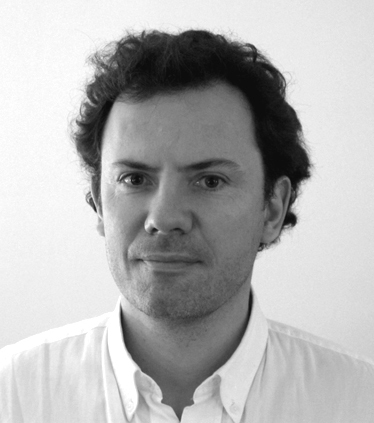
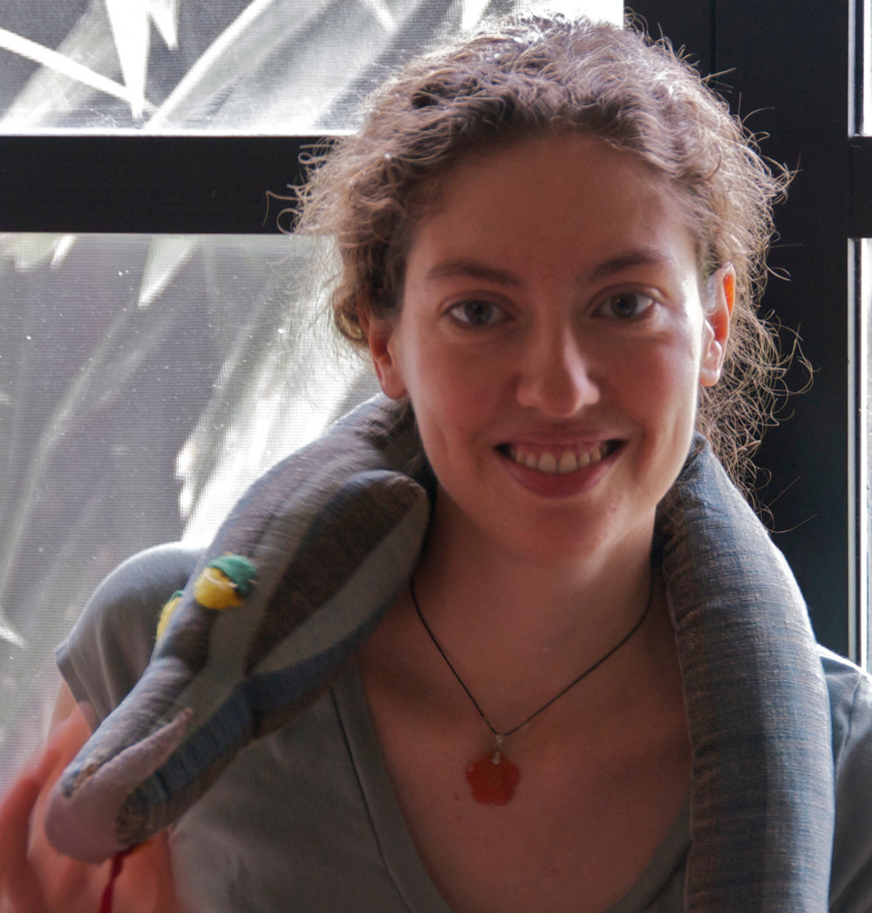
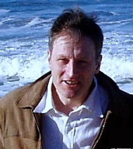
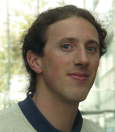
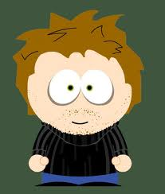

Les auteurs
===========

   **Emmanuel Dormy** - Directeur de Recherche au CNRS, il effectue sa
   recherche   au Département de Physique de l'ENS sur la mécanique des
   fluides, en particulier la magnétohydrodynamique et l'effet
   dynamo. Il enseigne depuis plusieurs années à l'ENS et à l'école
   Polytechnique. Il est en particulier depuis 5 ans Professeur du cours de
   Physique Numérique en M1 à l'ENS construit sur Python.

   **Emmanuelle Gouillart** travaille sur l'élaboration du verre et le
   mélange des fluides dans le laboratoire mixte CNRS / Saint-Gobain,
   comme chercheuse du centre de R&D Saint-Gobain Recherche. Elle a
   enseigné Python pour les scientifiques à des publics variés (de
   Dakar à Bombay !). L'importance du traitement d'image dans son
   travail l'a conduite à faire partie de l'équipe de développement du module
   scikit-image de Python.

   **Werner Krauth** - Directeur du Département de physique de l'ENS,
   Directeur de recherche au CNRS en physique, spécialité
   physique statistique et numérique. Enseignement avec Python
   depuis 2008 (cours de M1/M2 à l'ENS, à l'international).
   Utilisation massive de Python/NumPy/SciPy pour la recherche.    

   **Gaël Varoquaux** a fait des études de physique, mais il est tombé dans 
   le monde merveilleux de la recherche en informatique en voulant apprendre 
   à mieux modéliser ses données. Il travaille à l'INRIA, dans le centre 
   d'imagerie cérébrale Neurospin, où il s'intéresse à l'apprentissage de 
   modèles phénoménologiques du fonctionnement du cerveau. Il est aussi 
   fortement impliqué dans le développement d'outils scientifiques en Python. 

   **Damien Vergnaud** est maître de conférences en Informatique à l'ENS
   depuis 2007. Il es responsable du cours d'introduction à la
   programmation pour les non-informaticiens à l'ENS pour lequel
   le langage choisi est Python. Par ailleurs, il utilise très
   fréquemment Python et Sage dans le cadre de ses activités de
   recherche (centrées sur la cryptographie mathématique et la théorie 
   des nombres).

