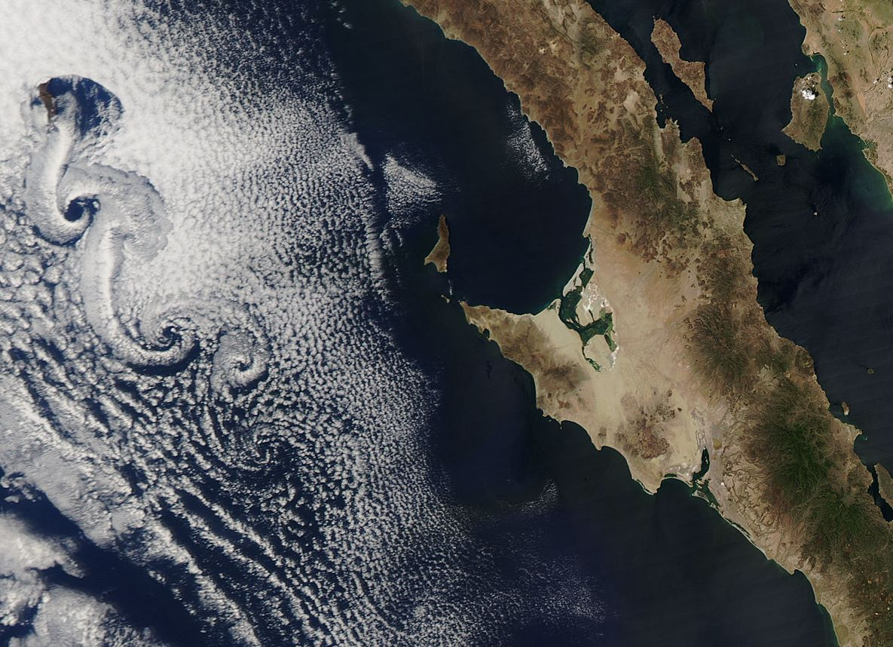

Hydrodynamique 2D, Allée de Von Karman
==========================================

Advection
--------------
On veut d'abord résoudre le problème d'advection scalaire
par un schéma de transport semi-Lagrangien.

Ecrire ce schéma dans un domaine p\'eriodique en completant le code

.. only:: html

    [:ref:`Advection source code <example_Advection.py>`]

Quelle observation peut-on faire sur le transport de colorant ?

Quel critère doit satisfaire dt pour que le schéma soit stable ?

Advection-Diffusion
--------------

Comprendre puis completer le programme :

.. only:: html

    [:ref:`Diffusion source code <example_Diffusion.py>`]

Projection
--------------

Comprendre puis completer le programme 

.. only:: html

    [:ref:`Projection source code <example_Projection.py>`]

Lignes d'émissions et lignes de courant
--------------

Modifier le programme

.. only:: html

    [:ref:`Von Karman source code <example_VonKarman.py>`]

Ajouter une visualisation de l'obstacle en utilisant la commande
``contour'' de Matplotlib.

En utilisant la commande ``streamplot'' de Matplotlib, ajouter une
visualisation des lignes de courant de l'écoulement à la fin de la
simulation.

