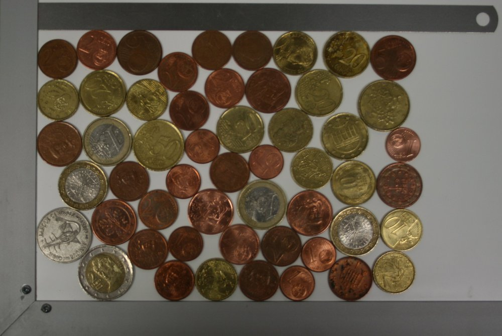
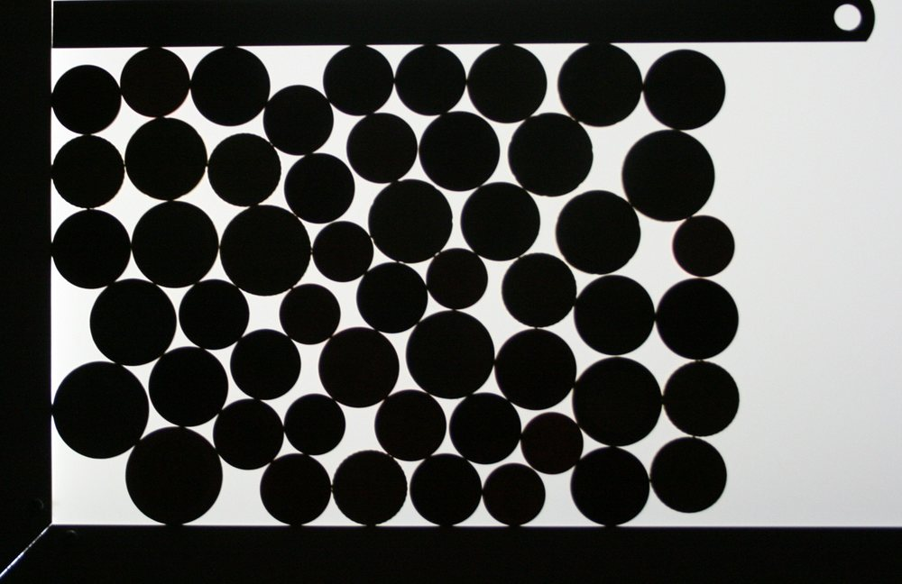

=======================================
Géométrie d'un matériaux granulaire 2-D
=======================================

______________

Les matériaux granulaires sont omni-présents dans l'industrie et
l'environnement. La science des matériaux granulaires est relativement
récente car elle a nécessité des techniques d'instrumentation et de
simulation qui n'ont fait leur apparition que tard. 

Dans cet atelier, on va s'intéresser à la géométrie d'un matériau
granulaire en deux dimensions, c'est-à-dire :

 * à la fraction de l'espace occupée par les grains, appelée la
   **compacité** du milieu granulaire

 * au nombre de voisins de chaque grain

Le matériau granulaire 2-D est un ensemble de pièces de monnaie,
ci-dessus on voit le matériau granulaire photographié avec deux
éclairages différents. Pour l'atelier on se servira de l'image la plus
contrastée. On pourra plus tard se convaincre de l'importance de
l'éclairage en essayant de reproduire les opérations sur l'autre image !

[:ref:`Solution de tout l'atelier <example_plot_granular.py>`]

Ouverture de l'image comme un tableau NumPy
-------------------------------------------

Sauver l'image contrastée ci-dessus (clic droit, sauver sous) dans le
répertoire de travail. Ouvrir l'image comme un tableau Numpy appelé
``img`` avec la fonction ``skimage.io.imread``.

Afficher l'image avec ``skimage.io.imshow``.

Quelle est la forme de l'image ? Le maximum des valeurs des pixels ? Le
minimum ?

Binarisation de l'image
-----------------------

On veut à présent séparer l'image en deux parties, 1) le fond et 2) les objets.Comme nous partons d'une image très contrastée, un simple seuillage va suffire pour donner un bon résultat. 

 * Utiliser la fonction ``skimage.filter.threshold_otsu`` pour choisir la
   valeur à laquelle seuiller l'image. Optionnel : tracer l'histogramme de
   l'image pour vérifier que cette valeur est cohérente avec celle qu'on
   aurait choisi "à la main". 

 * Créer une image booléenne ``mask`` qui vaut 1 pour les pixels inférieurs 
   au seuil dans l'image originale, et 0 pour les autres. On a ainsi créé 
   une binarisation de l'image en fond (à 0) et objets (à 1)

 * On peut maintenant calculer la compacité du matériau granulaire en
   calculant la fraction de l'espace occupée par des pixels des objets. Pour 
   s'affranchir des effets de bord, calculer cette fraction dans un
   rectangle intérieur loin des bords (comme le rectangle rouge ci-dessous)

.. figure:: auto_examples/images/plot_granular_1.png
    :scale: 80
    :target: auto_examples/plot_granular.html

Séparation des différents grains
--------------------------------

On souhaite maintenant attribuer les différents pixels de valeur 1 dans
``mask`` aux différents grains. Cette opération s'appelle la segmentation
de l'image. Comme la phase de valeur 1 est continue (les grains se
touchent), il n'y a pas d'opération simple permettant de faire cette
séparation en une étape.

En consultant la `gallerie du scikit-image
<http://scikit-image.org/docs/dev/auto_examples/>`_, on peut voir qu'il y
a justement un exemple où `on sépare deux objets collés
<http://scikit-image.org/docs/dev/auto_examples/plot_watershed.html>`_.

Cet exemple utilise un algorithme de segmentation appelé watershed
(montée des eaux en français), implémenté dans la fonction
``skimage.morphology.watershed``. Pour comprendre comment l'algorithme
fonctionne, lire l'exemple et la docstring de la fonction ``watershed``.

L'`algorithme de watershed
<http://en.wikipedia.org/wiki/Watershed_(image_processing)>`_:

 * part de pixels marqués comme appartenant à différents objets

 * agit sur une image dont on considère les différents niveaux de gris
   comme des altitudes, et où les pixels marqués vont typiquement être
   dans les creux de cette carte d'altitude.

 * fait grandir des régions à partir de ces pixels marqués, en remontant
   les niveaux de l'image d'entrée de l'algorithme. La propagation
   s'arrête quand deux régions se rencontrent.

Marqueurs
~~~~~~~~~

Il faut donc fournir à l'algorithme une image de marqueurs, où on aura
identifé quelques pixels appartenant de manière certaine à chaque grain.
Pour celà, on va éroder le masque jusqu'à séparer tous les grains. Il
s'agit d'une opération typique de `morphologie mathématique
<http://en.wikipedia.org/wiki/Mathematical_morphology>`_, qui se trouve
donc dans le sous-module ``skimage.morphology``. Une combinaison
d'opérations d'érosion qui fonctionne bien est::

    from skimage import morphology
    erosion = morphology.binary_erosion(mask, morphology.disk(9))
    erosion = morphology.binary_erosion(erosion, morphology.disk(5))

Afficher le tableau ``erosion`` après la 1e opération d'érosion, puis
après la 2e. Essayer d'autres paramétres pour la taille de l'érosion : si
on érode trop, on fait disparaître des grains, mais si on n'érode pas
assez, certains grains vont rester attachés...

.. figure:: auto_examples/images/plot_granular_2.png
    :width: 800px
    :target: auto_examples/plot_granular.html

Une fois qu'on a séparé les grains, utiliser la fonction
``skimage.morphology.label`` pour donner un indice différent à chaque
région de marqueurs. On appelera ``labs`` le tableau de marqueurs.

Carte d'élévation
~~~~~~~~~~~~~~~~~

Il faut maintenant créer une image où les minima correspondent à peu près
à la position des marqueurs, et les régions les plus élévées aux
séparations entre les grains. Pour celà, on va faire comme dans l'exemple
du scikit-image : créér une image où la valeur de chaque pixel correspond
à la distance du pixel au fonc dans le tableau ``mask``. Ce tableau aura
donc ses plus grandes valeurs au centre des disques, et ses plus petites
valeurs au bord des grains : il faudra prendre l'opposé de ce tableau
comme tableau d'entrée du watershed.

La fonction qui calcule la distance ne se trouve pas dans ``skimage``,
mais dans ``scipy.ndimage`` ::

    >>> from scipy import ndimage
    >>> ndimage.distance_transform_edt?

Appliquer cette fonction au tableau ``mask`` pour créer un tableau
``elevation_map``.

Segmentation
~~~~~~~~~~~~

On peut maintenant utiliser la fonction watershed sur le tableau
``elevation_map``, avec comme tableau de marqueurs le tableau ``labs``.
Afin d'attribuer uniquement les pixels correspondant aux objets (et pas
au fond), il faut également donner le tableau ``mask`` pour le keyword
argument (argument optionnel) ``mask``. 

Calculer le résultat du watershed : appeler le résultat ``regions``.

Propriétés des grains
---------------------

Maintenant que nous avons séparé l'image en plusieurs régions, on peut
calculer les propriétés des différentes régions. La fonction
``skimage.measure.regionprops`` sert justement à mesurer les propriétés
d'une image de labels. 

Calculer l'aire et le centroïde de chaque région avec cette fonction. La
fonction ``regionprops`` renvoie une liste de dictionnaire, on peut
boucler sur les éléments de la liste pour extraire à chaque dictionnaire
la clé correspondant à l'aire et au centroïde.

Quel est la taille du plus petit grain ?

(Remarque - optionnel : pour bien faire les choses proprement, on peut
mettre à 0 les régions correspondant aux bords du cadre de l'image.
Utiliser des masques (tableaux booléens) pour celà. Si on supprime
certaines régions, on peut réindicer les labels de manière à ce qu'ils
restent consécutifs grâce à la fonction
``skimage.segmentation.relabel_from_one``).

Nombre de voisins des grains
----------------------------

Nous voulons maintenant connaître les indices des voisins de chaque
grain, c'est-à-dire des grains qui touchent ce grain. Pour cela, une
solution est de dilater chaque grain (au sens de la morphologie
mathématique) et de repérer les indices recouverts par la dilatation du
grain.

Quelques indices :

 * boucler sur les objets en créant des masques ``regions == lab`` pour
   les différents labels ``lab``

 * utiliser ``skimage.morphology.binary_dilation`` pour dilater ce
   masque.

 * utiliser le masque dilaté pour extraire du tableau ``regions`` les
   valeurs des pixels recouverts par le masque.

 * utiliser la fonction ``np.unique`` pour ne garder qu'une occurrence de
   chaque valeur.

 * ajouter ces valeurs à un conteneur, par exemple une liste.

Quelle est la moyenne du nombre de voisins ? En deux dimensions, dans un
milieu granulaire sans frottement à l'équilibre mécanique la moyenne du
nombre de contacts est 4, pour assurer la condition d'iso-staticité. Dans
cet exemple on devrait trouver moins, car les grains frottent entre eux.

Une fois qu'on a extrait les voisins, on peut tracer des liens entre
voisins grâce à la fonction ``skimage.draw.line``.

.. figure:: auto_examples/images/plot_granular_3.png
    :scale: 70
    :target: auto_examples/plot_granular.html

[:ref:`La solution <example_plot_granular.py>`]

