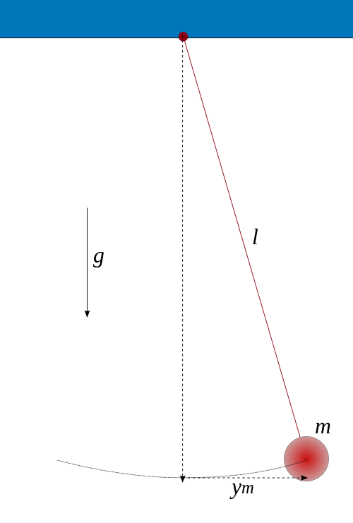

Equations aux dérivées partielles : utilisation de NumPy
==========================================

.. topic:: Contenu du chapitre

    * Présentation du module NumPy

    * Equation de la chaleur en 1D

TEXTE EN COURS...

On trouve dans le module **SciPy** les opérations de manipulation /
traitement de données numériques classiques, mais spécifiques à un type
d'application (algébre linéaire, statistiques, etc.). Il s'agit d'un
module stable, bien testé et relativement bien documenté. 

http://docs.scipy.org/doc/
http://docs.scipy.org/doc/scipy/reference/

 ::

    >>> import scipy

Le module SciPy réalise les différentes opérations sur des tableaux
numériques (``ndarray``) de ``numpy``. On peut donc directement utiliser
ces tableaux comme arguments pour les différentes fonctions ::

    >>> from scipy import linalg
    >>> mat = np.array([[1, 2], [2, 4]])
    >>> mat
    array([[1, 2],
        [2, 4]])
    >>> linalg.det(mat)
    0.0

Pour montrer l'utilisation de SciPy, nous allons nous intéresser à
l'intégration d'équations différentielles, en considérant de systèmes
dynamiques à base de pendules mécaniques. 

Pendule simple
--------------

L'équation du pendule simple est donnée par

.. math::

    \ddot{\theta} + \omega^2 \sin\theta = 0

(expliquer)

Pour les petites oscillations on peut faire l'approximation
:math:`\sin\theta\simeq\theta`. Quand l'approximation n'est pas valide il
faut intégrer numériquement cette équation différentielle pour obtenir
l'évolution de la position et de la vitesse angulaire du pendule, au
cours du temps. 

Il nous faut donc disposer d'un intégrateur d'équations différentielles,
que l'on peut s'attendre à trouver dans SciPy. Mais quelle est la
fonction correspondante ? Tentont une recherche Google "scipy integrate
differential equation", ou la consultation du sommaire de l'aide
http://docs.scipy.org/doc/scipy/reference/index.html. Il existe un
sous-module ``integrate``, qui contient lui-même une fonction
``odeint`` ::

    from scipy.integrate import odeint
    
Regarder la doc de la fonction
http://docs.scipy.org/doc/scipy/reference/generated/scipy.integrate.odeint.html#scipy.integrate.odeint
et l'exemple
http://docs.scipy.org/doc/scipy/reference/tutorial/integrate.html#ordinary-differential-equations-odeint

Pour commencer, il faut mettre l'équation différentielle du 2nd ordre
sous la forme d'un système d'équations du premier ordre ::

    def simple_pendulum(theta_thetadot, t):
	theta, theta_dot = theta_thetadot
	return [theta_dot, - np.sin(theta)]

correspondant à 

.. math::

    \frac{\mathrm{d}\theta}{\mathrm{d}t} = \dot{\theta}

    \frac{\mathrm{d}\dot{\theta}}{\mathrm{d}t} = -\sin\theta

Nous pouvons maintenant intégrer une trajectoire à partir d'une condition
initiale ::

    >>> t = np.linspace(0, 5 * np.pi, 1000)
    >>> sol = odeint(simple_pendulum, (np.pi/3, 0), t)

Nous pouvons par exemple vérifier la conservation de l'énergie mécanique
au cours du temps :

.. figure:: auto_examples/images/plot_simple_pendulum_1.png
    :scale: 80
    :target: auto_examples/plot_simple_pendulum.html

Pour générer la figure ci-dessous, on a utilisé un certain nombre de
commandes du module ``matplotlib``.

.. only:: html

    [:ref:`Python source code <example_plot_simple_pendulum.py>`]

Pour construire les différents éléments de la figure (courbe, labels,
légende, etc.), il existe des fonctions dédiées de matplotlib qu'on peut
"découvrir" grâce à la documentation de matplotlib
http://matplotlib.org/. En particulier, la gallerie d'exemples
http://matplotlib.org/gallery.html est très utile pour voir comment
générer différents types de figures.

Pendule forcé
-------------

On peut rajouter un degré de liberté au système dynamique du pendule en
imposant un forçage dépendant du temps, par exemple périodique en temps.
Nous allons également considérer un amortissement du pendule dû au
frottement de l'air. On considère alors l'équation suivante pour le
pendule forcé 

.. math::

    \ddot{\theta} + q \dot{\theta} + \omega^2 \sin\theta = A \sin
    \omega_D t   

Comme auparavant, on normalise le temps en fixant :math:`\omega = 1`. Il
reste alors trois paramètres sur lesquels on peut jouer : A, q et
:math:`\omega_D`. On définit donc une nouvelle fonction définissant le
système dynamique du premier ordre ::

    def forced_pendulum_equations(y, t, q, acc, omega):
        theta, theta_dot = y
        return [theta_dot, acc * np.sin(omega * t) - \
                        np.sin(theta) - q * theta_dot]
   

Par commodité, on va également définir une fonction permettant d'intégrer
une trajectoire à partir d'une condition initiale, sur un certain
intervalle de temps::

    def forced_pendulum(t_end, t_space, theta_init, theta_dot_init=0, q=0.1,
                                acc=1, omega=1):
        t_range = np.arange(0, t_end, t_space)
        sol = odeint(forced_pendulum_equations, [theta_init, theta_dot_init],
                                t_range, args=(q, acc, omega))
        return np.vstack((t_range, sol.T))

On peut à présent intégrer une trajectoire::

    >>> omega = 2./3
    >>> dt = 2*np.pi / omega / 25
    >>> tf = 1000
    >>> t, theta_0, theta_dot_0 = forced_pendulum(tf, dt, np.pi/3, 0,
    q=0.5, acc=1, omega=omega)

Pour cette trajectoire, l'évolution de :math:`\theta` reste périodique,
avec la même période que la période de forçage ::

    >>> import matplotlib.pyplot as plt
    >>> plt.plot(t, theta_0) # courbe bleue

Quand on augmente l'amplitude du forçage, le mouvement reste périodique
après un régime transitoire assez long. On observe par contre un
doublement de période, l'amplitude de l'oscillation varie entre deux
périodes du forçage ::

    >>> t, theta_1, theta_dot_1 = forced_pendulum(tf, dt, np.pi/3, 0,
    q=0.5, acc=1.08, omega=omega)
    >>> plt.plot(t, theta_1) # courbe verte

Enfin, quand on augmente encore l'amplitude du forçage, le mouvement
n'est plus périodique et semble "chaotique"::

    >>> t, theta_2, theta_dot_2 = forced_pendulum(tf, dt, np.pi/3, 0,
    q=0.5, acc=1.17, omega=omega)
    >>> plt.plot(t, theta_2) # courbe rouge

.. figure:: auto_examples/images/plot_spectra_1.png
    :scale: 80
    :target: auto_examples/plot_spectra.html

On va confirmer l'observation du doublement de période grâce à la
transformée de Fourier discrète des signaux. Pour la transformée de
Fourier discrète, il existe également un sous-module de ``SciPy``::

    >>> from scipy import fftpack  

Il faut tout d'abord sélectionner la partie du signal qui semble
périodique, c'est-à-dire enlever le régime transitoire. On utilise pour
cela un masque de booléens ::

    >>> time_mask = t > 400
    >>> theta_0 = theta_0[time_mask]
 
Comme on n'est pas intéressé par la fréquence nulle, on soustrait la
moyenne du signal ::

    >>> theta_0 -= theta_0.mean()

Notons qu'on peut soustraire un scalaire à un tableau `ndarray` : la
soustraction est alors faite élément par élément.

On calcule la transformée de Fourier discrète de :math:`\theta_0`::

    >>> fft_theta_0 = fftpack.fft(theta_0)

Pour représenter la TF, il nous faut également un tableau des fréquences
correspondant au tableau fft_theta_0. Il y a pour cela une fonction
dédiée dans le module ``fftpack``, ``fftfreq``::

    >>> freq = fftpack.fftfreq(len(theta_0), dt)

On peut alors représenter le module de la transformée de Fourier en
fonction de la fréquence ::

    >>> plt.plot(freq, np.abs(fft_theta_0), lw=2)

On observe que la fréquence fondamentale du signal correspond à la
fréquence de forçage :math:`f_D`. On observe aussi une harmonique triple
à :math:`3 f_D`.

.. figure:: auto_examples/images/plot_fft_1.png
    :scale: 80
    :target: auto_examples/plot_fft.html

Pour le forçage intermédiaire, on refait la même série d'opérations :: 

    >>> theta_1 = theta_1[time_mask]
    >>> theta_1 -= theta_1.mean()
    >>> fft_theta_1 = fftpack.fft(theta_1)
    >>> plt.plot(freq, np.abs(fft_theta_1), lw=2)

On observe alors un nouveau pic à la fréquence moitiés :math:`f_D/2`,
correspondant à un doublement de période.

Pour aller plus loin, on peut visualiser l'évolution du spectre de
:math:`\theta` pour un grand nombre de paramètres en codant par la couleur l'amplitude du module de la transformée de Fourier::

    >>> omega = 2./3
    >>> dt = 2*np.pi / omega / 25
    >>> tf = 1000
    >>> acc_factors = np.linspace(1, 1.5, 100)
    >>> fft_sig = []
    >>> 
    >>> t = np.arange(0, tf, dt)
    >>> mask = t > 400
    >>> hann = signal.hanning(mask.sum())
    >>> 
    >>> for i, acc in enumerate(acc_factors):
    >>>     print i
    >>>     t, theta, theta_dot = forced_pendulum(tf, dt, np.pi/3, 0,
    >>>                         q=0.5, acc=acc, omega=omega)
    >>>     theta = theta[mask]
    >>>     theta -= theta.mean()
    >>>     theta /= np.sqrt((theta**2).mean())
    >>>     theta *= hann
    >>>     fft_sig.append(fftpack.fft(theta))
    >>> 
    >>> fft_sig = np.array(fft_sig)
    >>> plt.imshow(np.log(np.abs(fft_sig[:, :500]).T), aspect='auto',
                interpolation='nearest')

On observe alors la cascade de transition vers le chaos, avec des fenêtre
chaotiques et d'autres périodiques. 

.. figure:: auto_examples/images/plot_cascade_1.png
    :scale: 80
    :target: auto_examples/plot_cascade.html

Dans le régime chaotique, on peut vérifier que deux trajectoires
initialement très proches s'éloignent très vite::

    >>> omega = 2./3
    >>> dt = 2*np.pi / omega / 25
    >>> tf = 1000
    >>> acc = 1.17
    >>> eps = 1.e-8
    >>> 
    >>> t, theta_0, theta_dot_0 = forced_pendulum(tf, dt, np.pi/3, 0,
    ...                         q=0.5, acc=acc, omega=omega)
    >>> t, theta_1, theta_dot_1 = forced_pendulum(tf, dt, (1 + eps) *
    np.pi/3, 0,
    ...                         q=0.5, acc=acc, omega=omega) 
    >>> # Compute the distance between the two trajectories
    >>> dist = np.hypot(theta_1 - theta_0, theta_dot_1 - theta_dot_1)

.. figure:: auto_examples/images/plot_chaos_1.png
    :scale: 80
    :target: auto_examples/plot_chaos.html

En coordonnées logarithmiques, on voit que la distance entre les
trajectoires croît de manière exponentielle au cours du temps. Il s'agit
d'une propriété caractéristique du chaos.

.. topic:: Pour aller plus loin
   
    On peut représenter en 3-D le cycle limite décrivant la dynamique du
    pendule. 
    
    .. figure:: auto_examples/images/plot_dyna_1.png
        :scale: 80
        :target: auto_examples/plot_dyna.html

    .. only:: html

        [:ref:`Python source code <example_plot_dyna.py>`]

Ecriture de documentation
-------------------------
  
Dans l'exemple précédent du pendule forcé, la fonction
``forced_pendulum`` est une fonction haut niveau, que l'utilisateur final
va souvent manipuler. Pour cela, il est recommandé d'écrire une bonne
documentation pour la fonction ``forced_pendulum``. Il existe un standard
pour l'écriture de docstrings hérité de NumPy, et documenté sur
https://github.com/numpy/numpy/blob/master/doc/HOWTO_DOCUMENT.rst.txt.
Les différentes sections sont toujours dans le même ordre, ce qui permet
une lecture rapide et efficace de la documentation::

    def forced_pendulum(t_end, t_space, theta_init, theta_dot_init=0, q=0.1,
                                acc=1, omega=1):
        """
        Integrate a trajectory for the forced pendulum.

        Parameters
        ----------

        t_end : float
            Final time of the trajectory (initial time is always 0).

        t_space : float
            Time_interval between two points of the trajectories

        theta_init : float
            Initial angular position

        theta_dot_init : float, optional
            Initial angular velocity (default 0)

        q : float, optional
            Damping (default 0.1)

        acc : float, optional
            Amplitude of the forcing (default 1)

        omega : float, optional
            Pulsation of forcing (default 1)

        Returns
        -------
        t: ndarray of floats
            array of times
        theta: ndarray of floats
            angular positions along the trajectory

        theta_dot: ndarray of floats
            angular velocities along the trajectory

        Notes
        -----
        This function integrates the equation
        .. math::

            \ddot{\\theta} + q \dot{\\theta} + \omega^2 \sin\\theta = A \sin
                \omega_D t

        Examples
        --------
        >>> t, theta, theta_dot =  forced_pendulum(100, 0.1, np.pi/3)
        >>> sol = forced_pendulum(100, 0.1, np.pi/3, theta_dot_init=1, acc=1.5)
        """
        t_range = np.arange(0, t_end, t_space)
        sol = odeint(forced_pendulum_equations, [theta_init, theta_dot_init],
                                t_range, args=(q, acc, omega))
        return np.vstack((t_range, sol.T))

