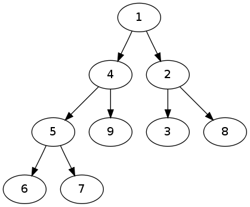

Utilisation avancée du langage Python : un exemple de la théorie de l'information
========================================================

Modules et fichiers
-------------------

Modules
.......

On peut ranger les définitions de fonctions se rapportant à une même
application au sein d'un script commun baptisé **module**

Un module est sauvegardé sous forme d'un fichier dont le nom a la
forme ``<nom du module>.py``

Pour utiliser un module, il faut se servir de l'instruction ::

  import <nom du module>

L'exécution de cette instruction consiste à exécuter le script
définissant le module (ce script peut contenir des instructions autres
que des définitions de fonctions).

Pour importer un module, Python a besoin de connaître le chemin qui
permet d'accéder au fichier correspondant. Ce chemin doit apparaître
dans la liste des chemins possibles stockés dans la variable ``path`` du
module ``sys``

**Première méthode d'importation** 

::

  >>> import random 
  >>> random.randint(0,10) 
  9

* L'instruction import permet d'importer toutes les fonctions du
  module random
* Ensuite, nous utilisons la fonction (ou méthode) randint(a,b) du
  module random; attention cette fonction renvoie un nombre entier
  aléatoirement entre a inclus et b inclus

**Deuxième méthode d'importation** 

Pour disposer d'une fonction du module ::

  from [module] import [fonction]

Pour disposer de toutes les fonctions d'un module ::

  from [module] import *

.. note:: Cette option est cependant à éviter notament lorsqu'un module propose un nombre important de fonctions et parce que certains modules ont des fonctions qui ont le même nom (par exemple, ``math`` et ``numpy``)

::

  from math import * 
  sept = sqrt(49) 
  angle = pi/6 
  print sin(angle)

____

**Modules courants** 

* sys : passage d'arguments, gestion de l'entrée/sortie standard
  etc...
* os : dialogue avec le système d'exploitation.
* math : fonctions et constantes mathématiques de base (sin, cos, exp,
  pi...).
* random : génération de nombres aléatoires.
* time : permet d'accéder aux fonctions gérant le temps.
* urllib : permet de récupérer des données sur internet depuis python.
* re : gestion des expressions régulières.
* numpy, scipy: modules incontournables du calcul scientifique
* Tkinter : interface graphique
* ...

Fichiers 
........

Pour permettre une interaction avec l'utilisateur, la méthode la plus simple consiste à employer la fonction ``raw_input()``
:

::

  print('Entrez votre prénom : ') 
  prenom = raw_input() 
  print 'Bonjour,', prenom

::

  prenom = raw_input('Entrez votre prénom : ') 
  print 'Bonjour,', prenom

.. note:: La fonction ``raw_input()`` renvoie toujours une chaîne de caractères alors que la fonction ``input()`` renvoie une valeur dont le type correspond à ce que l'utilisateur a entré`(i.e. une chaîne de caractères doit être entrée avec des guillemets).

Il est généralement important de dissocier les données des programmes qui les
utilisent en rangeant ces données dans des fichiers séparés.

Le module ``os`` contient des fonctions qui permettent de localiser
les fichiers :

* ``getcwd()`` : Retourne le chemin du répertoire courant
* ``chdir(<ch>)`` : Change le répertoire courant qui prend la valeur
  donnée par la chaîne <ch>
* ``path.isfile(<ch>)`` : Retourne un booléen qui indique s'il existe
  un fichier de chemin <ch>
* ``path.isdir(<ch>)`` : Retourne un booléen qui indique s'il existe
  un répertoire de chemin <ch>

::

  from os import chdir 
  chdir("/home/exercices")

.. note:: En mode interactif, iPython reconnaît les commandes consoles traditionnelles (ls, cd, pwd, ...)

Pour utiliser un fichier identifié par le chemin <ch> dans un
programme Python, il faut commencer par l'ouvrir par l'appel de
fonction

::
  
  open(<ch>, [<mode>])

qui retourne un objet de type file.

Le paramètre facultatif ``<mode>`` indique le mode d'ouverture du
fichier :

- ``r`` : mode lecture (le fichier doit exister préalablement)
- ``w`` : mode écriture (si le fichier existe, les données sont
  écrasées, sinon le fichier est créé)
- ``a`` : mode ajout (si le fichier existe, les données écrites vont
  l'être après celles existantes, sinon le fichier est créé)

Si le mode est omis, le mode par défaut est ``r``.

Un objet de type ``file`` est associé à des attributs et des
méthodes. En voici quelques-unes :

- ``read([<n>])`` : retourne la chaîne des <n> caractères restants
- ``readline()`` : lit une seule ligne à partir du fichier
- ``readlines()`` : utilise f.readline() de façon répétitive, et
  retourne une liste contenant toutes les lignes du fichier.
- ``write(<ch>)`` : écrit la chaîne de caractères <ch>
- ``close()`` : ferme le fichier
- ``seek(<n>)`` : choisit le caractère <n> comme position courante du
  fichier
- ``tell()`` : retourne le caractère en position courante

:: 

    # Exemple de copie intégrale d'un fichier 
    fs = open("source.txt", 'r')
    fd = open("destination.txt", 'w')
    while 1:
        txt = fs.read(50) # copie de 50 caractères à la fois
        if txt == "":
            break
        fd.write(txt)
    fs.close()
    fd.close()

.. note:: Python fournit le module standard *pickle* qui peut prendre (presque) n'importe quel objet Python et le convertir en une représentation sous forme de chaîne de caractères (et le reconstruire). Il s'agit du moyen standard pour enregistrer des objets Python et les réutiliser dans d'autres programmes.

Structures de données en Python
-------------------------------

Utilisation avancée des listes 
..............................

**Les fonctions héritées du fonctionnel.** 
La fonction ``map`` permet de transformer une liste via l'utilisation 
d'une fonction.  Elle prend en entrée une fonction et une liste et
retourne une nouvelle liste en appelant la fonction sur chaque élément
de la liste dans l'ordre. Voici quelques exemples d'utilisation : ::

  def carre(x): 
      return x ** 2 
  def pair(x): 
      return not bool(x % 2)
  
  print map(carre, [1, 2, 3, 4, 5]) 
  # Affiche [1, 4, 9, 16, 25]
  
  print map(pair, [1, 2, 3, 4, 5]) 
  # Affiche [False, True, False, True, False]

Comme dans les langages fonctionnels, avec le mot-clé ``lambda``, il
est possible de créer des fonctions anonymes. Le premier exemple est
équivalent à ::

  print map(lambda x: x**2, [1, 2, 3, 4, 5]) 
  # Affiche [1, 4, 9, 16, 25]

La fonction **filter** permet de retirer les valeurs d'une liste que
l'on ne veut pas.  Elle prend en entrée une fonction et une liste et
retourne la liste des éléments (dans l'ordre) sur lesquels la fonction
retourne le booléen ``True``. ::
	
  def petit_carre(x): 
      return x ** 2 < 16 
  def pair(x): 
      return not bool(x % 2)
  
  print filter(petit_carre, [1, 2, 3, 4, 5]) 
  # Affiche [1, 2, 3]
  
  print filter(pair, [1, 2, 3, 4, 5]) 
  # Affiche [2, 4], c'est à dire les nombres pairs de la liste.

**Les compréhensions de liste.**
Les compréhensions de liste sont des outils puissants permettant
d'utiliser map et filter avec une syntaxe plus proche de celle
habituelle en Python. De plus, elles permettent de combiner un ``map`` et
un ``filter`` en même temps.

Voici la syntaxe avec les exemples vus précédemment ::
	
  # Affiche les carrés des éléments 
  liste = [1, 2, 3, 4, 5, 6, 7]
  print [x ** 2 for x in liste] 
  # Équivaut au map, en plus lisible et plus simple :) .
  
  # Affiche les nombres pairs 
  print [x for x in liste if x % 2 == 0] 
  # Plus simple que filter, également :)
  
  # Affiche les carrés pairs (combinaison des deux) 
  print [x ** 2 for x in liste if x ** 2 % 2 == 0] 
  # ou print [x for x in [a ** 2 for a in liste] if x % 2 == 0]

**Méthodes supplémentaires sur les listes**

Voici une liste des méthodes des objets de type liste les plus utiles :

 :``L.append(x)``:

    Ajoute l'élément x à la fin de la liste L

 :``L1.extend(L2)``:

    Étend la liste L1 en y ajoutant tous les éléments de la liste L2

 :``L.insert(i, x)``:

    Insère l'élément x dans la liste L à la position i

 :``L.remove(x)``:

    Supprime de la liste L le premier élément dont la valeur est x. 

 :``L.pop([i])``:

    Enlève de la liste L l’élément situé à la position i
 
    Si aucune position n’est indiqué, L.pop() enlève et retourne le dernier élément de la liste 

 :``L.index(x)``:

    Retourne la position du premier élément de la liste L ayant la valeur x. 

 :``L.sort()``:

    Trie les éléments de la liste, en place.

 :``L.reverse()``:

    Inverse l’ordre des éléments de la liste, en place.

.. note:: Ces méthodes permettent d'utiliser les listes comme des piles (i.e. une structure de donnée “dernier entré, premier sorti” ou LIFO) L'ajout d'un élément sur la pile se fait avec la méthode ``append()`` et la méthode ``pop()`` permet de récupérer l’objet au sommet de la pile. Cependant, les listes ne sont pas adaptées pour implanter des files (i.e. une structure de donnée "dernier entré, dernier sorti" ou FIFO) pour lesquelles il vaut mieux utiliser la classe ``collections.deque``.

Un exemple de structures de donnée complexe : Le tas
....................................................

**Tas binaire.** Un tas binaire (en anglais, heap) est une structure de données qui :

- est un arbre binaire 
- est ordonné de sorte que la clé d'un nœud est toujours inférieure à la clé de ses fils (de sorte que son plus petit élément est toujours la racine de l'arbre).

Les tas binaires supportent les opérations suivantes :

- Construire-Tas
- Ajouter-Élément
- Consulter-Sommet
- Retirer-Élément
- Tamiser (refabriquer le tas pour qu'il retrouve ses propriétés; par exemple suite à l'ajout ou la suppression d'un élément)

Les tas permettent notamment d'implanter les **files de priorité** qui permettent d'effectuer les trois opérations suivantes :

- insérer un élément
- lire puis supprimer l'élément ayant la plus grande clé
- tester si la file de priorité est vide ou pas

**Module heapq**. Ce module propose une implantation efficace des tas binaires (et des files de priorité) qui utilise naturellement des tableaux. 

::

  import heapq

Les fonctions suivantes sont notamment définies :

 :``heapq.heappush(T, x)``:

    Ajoute la valeur x au tas T (en conservant la propriété de tas)

 :``heapq.heappop(T)``:

    Enlève et retourne le premier élément du tas T

 :``heapq.heapify(L)``:

    Transforme la liste L en un tas (en place et en temps linéaire)

.. note:: En pratique, puisque un tas est un arbre binaire, l'implantation utilise des tableaux unidimensionel de sorte que ``tas[k] <= tas[2*k+1]`` et ``tas[k] <= tas[2*k]`` pour tout ``k``. En particulier le père d'un noeud en position ``k`` a pour position ``(k-1)/2`` et les fils d'un noeud en position ``k`` sont situés aux positions ``2*k`` et ``2*k+1``.

::

   In [1]: from heapq import *

   In [2]: L = [7,4,8,1,9,3,2,6,5]

   In [3]: heapify(L)

   In [4]: L
   Out[4]: [1, 4, 2, 5, 9, 3, 8, 6, 7]

Arbres de Huffman 
-----------------

Principe
........
Le **codage de Huffman** est une méthode de compression de données
sans perte proposé par David Huffman en 1952. Elle consiste à
attribuer un mot binaire de longueur variable aux différents symboles
du document à compresser (pixels ou caractères par exemple).  Les
symboles les plus fréquents sont codés avec des mots courts, tandis
que les symboles les plus rares sont encodés avec des mots plus longs
(rappelant ainsi le principe de l'alphabet Morse). Le code construit a
la particularité de ne posséder aucun mot ayant pour préfixe un autre
mot (i.e.  il s'agit d'un code préfixe).

Le codage de Huffman crée un arbre binaire à partir de tous les
symboles et de leur nombre d'occurrences dans le document :

- chaque caractère constitue une des feuilles de l'arbre à laquelle on
  associe un poids valant son nombre d'occurrences
- l'arbre est créé récursivement en associant à chaque étape les deux nœuds de plus faibles poids pour donner un nœud dont le poids est égal à la somme des poids de ses fils jusqu'à n'en avoir plus qu'un, la racine.

L'utilisation d'un tas pour construire cet arbre est donc particulièrement appropriée. 

On associe ensuite le code 0 à la branche de gauche et le code 1 à la
branche de droite et le code binaire de chaque symbole est alors
obtenu en parcourant la racine jusqu'à la feuille et en notant le
parcours (0 ou 1) à chaque noeud.

Un arbre d'Huffman associé au texte "PROGRAMMATION EN LANGAGE PYTHON"
est donné sur la figure suivante :

.. figure:: HuffmanTree.png

La lettre "A" avec 4 occurrences est codée par le triplet 011 alors
que la lettre Y plus rare est codée par le mot de 5 bits 01001.

Implantation du codage de Huffman en Python
.............................................
**Table des occurrences.** La première étape de la méthode de compression de Huffman consiste à compter le nombre d'occurrences de chaque symbole. 

.. topic:: **Exercice**: Construire une table des occurrences
    :class: green

    Écrire une fonction ``table_frequences`` qui étant donné une chaîne de caractère ``texte`` retourne un dictionnaire qui associe à chaque caractère son nombre d'occurrences dans ``texte``. 

    Le prototype de la fonction sera le suivant ::

       def table_frequences(texte): 

    et :: 

      	 table_frequences("ABRACADABRA")

    devra retourner un dictionnaire de la forme ::

         {'A': 5, 'R': 2, 'B': 2, 'C': 1, 'D': 1}
   	 

.. topic:: **Solution**: 

    ::

        def table_frequences(texte):
    	    table = {}
	    for caractere in texte:
	        if caractere in table:
	            table[caractere] = table[caractere] + 1
	        else:
	            table[caractere] = 1
	    return table

**Arbre de Huffman.** Une approche naturelle pour construire l'arbre de Huffman à partir de la table des occurrences consiste à utiliser un tas binaire.  

Dans un premier temps, on peut construire un tas correspondant à la table des occurrences (qui aura donc le caractère le moins fréquent à la racine). Ensuite, il faut utiliser cette structure pour construire récursivement l'arbre binaire : 

- en recherchant les deux noeuds de plus petit poids (en utilisant la structure de tas)
- en fusionnant ces deux noeuds en un seul :

  - dont le poids est égal à la somme des poids des deux noeuds 
  - qui a ces deux noeuds comme fils

Une représentation possible pour le noeud ainsi construit est d'utiliser un dictionnaire à deux clés (par exemple 0 pour gauche et 1 pour droite) dont les valeurs sont les représentations des noeuds initiaux.

.. topic:: **Exercice**: Construire un arbre de Huffman
    :class: green

    Écrire une fonction ``arbre_huffman`` qui étant donné un dictionnaire construit par la fonction précédente retourne une représentation de l'arbre de Huffman correspondant. 

    Le prototype de la fonction sera le suivant ::

       def arbre_huffman (occurrences): 

    et l'appel de :: 

      	 arbre_huffman(table_frequences("ABRACADABRA"))

    devra retourner un dictionnaire de la forme ::

    	  {0: 'A', 1: {0: 'R', 1: {0: {0: 'C', 1: 'D'}, 1: 'B'}}}

.. topic:: **Solution**: 

::

    def arbre_huffman(occurrences): 
        # Construction d'un tas avec les lettres sous forme de feuilles
        tas = [(occ, lettre) for (lettre, occ) in occurrences.items()] 
        heapify(tas)

        # Création de l'arbre
        while len(tas) >= 2: 
      	    occ1, noeud1 = heappop(tas) # noeud de plus petit poids occ1
 	    occ2, noeud2 = heappop(tas) # noeud de deuxième plus petit poids occ2
 	    heappush(tas, (occ1 + occ2, {0: noeud1, 1: noeud2}))
	    # ajoute au tas le noeud de poids occ1+occ2 et avec les fils noeud1 et noeud2

        return heappop(tas)[1]

**Code de Huffman**

.. topic:: **Exercice**: Code de Huffman 
    :class: green

    Écrire une fonction ``code_huffman`` qui étant donné un arbre de Huffman construit par la fonction précédente retourne un dictionnaire où les clés sont les chaînes binaires et les valeurs les caractères correspondants.

    Le prototype de la fonction sera le suivant ::

       def code_huffman(arbre): 

    et l'appel de :: 

         C = code_huffman(T)
	 print T

    avec T l'arbre précédent, devra retourner un dictionnaire de la forme suivante ::

    	 {'10': 'R', '111': 'B', '0': 'A', '1100': 'C', '1101': 'D'}

.. topic:: **Solution**: 

::

    def code_huffman_parcours(arbre,prefixe,code):
        for noeud in arbre:
            if len(arbre[noeud]) == 1:
                code[prefixe+noeud] = arbre[noeud]
            else:
                code_huffman_parcours(arbre[noeud],prefixe+noeud,code)

    def code_huffman(arbre):
        code = {}
        code_huffman_parcours(arbre,'',code)
        return code

**Encodage et décodage**

.. topic:: **Exercice**: Encodage 
    :class: green

    Écrire une fonction ``encodage`` qui étant donné un code de Huffman construit par la fonction précédente et le texte initial retourne la chaîne de bits produite par le codage de Huffman.

    Le prototype de la fonction sera le suivant ::

       def encodage(code,texte): 

    et l'appel de :: 

         encodage(C,"ABRACADABRA")

    avec C le code précédent, devra retourner la chaîne binaire suivante ::

    	  "01111001100011010111100"

.. topic:: **Solution**: 

    ::

	def encodage(texte,code):
	    code_inv = dict((code[bits], bits) for bits in code)
	    # construit le dictionnaire inverse
    	    texte_binaire = ''
    	    for c in texte:
                texte_binaire = texte_binaire + code_inv[c]
    	    return texte_binaire

.. topic:: **Exercice**: Décodage 
    :class: green

    Écrire une fonction ``decodage`` qui étant donnés un code de Huffman et un texte binaire compressé retourne le texte initial.

    Le prototype de la fonction sera le suivant ::

       def decodage(code,texte_binaire): 

    et l'appel de :: 

         encodage(T,"01111001100011010111100")

    avec C le code précédent, devra retourner la chaîne binaire suivante ::

    	 "ABRACADABRA"
    	 

.. topic:: **Solution**: 

    ::

	def decodage(code,texte_binaire):
	    texte = ''
	    tampon = ''
	    for b in texte_binaire:
	        tampon = tampon+b
                if tampon in code:
	            texte = texte+code[tampon]
                    tampon = ''
    	    return texte
