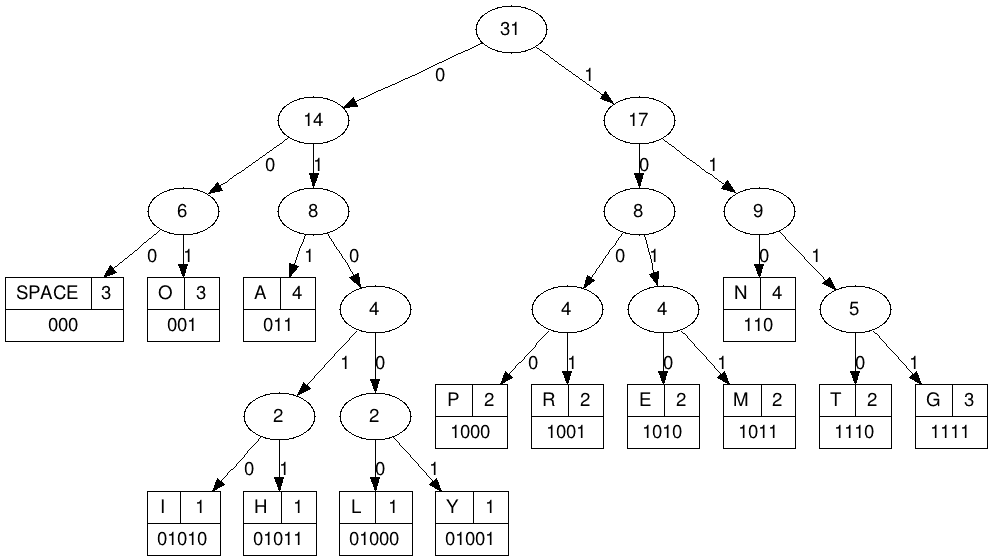

Théorie de l'information : utilisation du langage Python
========================================================

Entrées et Sorties 
------------------

Formattage de sortie
....................

Fichiers
........

Il est important de dissocier les données des programmes qui les utilisent en rangeant ces données 
dans des fichiers séparés.

Le module os contient des fonctions qui permettent de localiser les fichiers :

* getcwd() : Retourne le chemin du répertoire courant
* chdir(<ch>) : Change le répertoire courant qui prend la valeur donnée par la chaîne <ch>
* path.isfile(<ch>) : Retourne un booléen qui indique s'il existe un fichier de chemin <ch>
* path.isdir(<ch>) : Retourne un booléen qui indique s'il existe un répertoire de chemin <ch>

::

  >>> from os import chdir
  >>> chdir("/home/exercices")

Pour utiliser un fichier identifié par le chemin <ch> dans un programme Python, 
il faut commencer par l'ouvrir par l'appel de fonction

::
  
  open(<ch>, [<mode>])

qui retourne un objet de type file.

Le paramètre facultatif <mode> indique le mode d'ouverture du chier :

- r : mode lecture (le fichier doit exister préalablement)
- w : mode écriture (si le fichier existe, les données sont écrasées, sinon le fichier est créé)
- a : mode ajout (si le fichier existe, les données écrites vont l'être après celles existantes, sinon le fichier est créé)

Si le mode est omis, le mode par défaut est r.

Un objet de type file est associé à des attributs et des méthodes. En voici quelques-unes :

- read([<n>]) : retourne la chaîne des <n> caractères restants
- readline() : lit une seule ligne à partir du fichier
- readlines() : utilise f.readline() de façon répétitive, et retourne une liste contenant toutes les lignes du fichier. 
- write(<ch>) : écrit la chaîne de caractères <ch>
- close() : ferme le fichier 
- seek(<n>) : choisit le caractère <n> comme position courante du fichier
- tell() : retourne le caractère en position courante

.. note:: 
Python fournit le module standard *pickle* qui peut prendre (presque) n'importe quel objet Python
et le convertir en une représentation sous forme de chaîne de caractères (et le reconstruire). Il s'agit du 
moyen standard pour enregistrer des objets Python et les réutiliser dans d'autres programmes.

Modules
-------

On peut ranger les définitions de fonctions se rapportant à une même
application au sein d'un script commun baptisé **module**

Un module est sauvegardé sous forme d'un fichier dont le nom a la forme
<nom du module>.py

Pour utiliser un module, il faut se servir de l'instruction ::

  import <nom du module>

L'exécution de cette instruction consiste à exécuter le script définissant le
module (ce script peut contenir des instructions autres que des définitions de
fonctions).

Pour importer un module, Python a besoin de connaître le chemin qui permet
d'accéder au chier correspondant. Ce chemin doit apparaître dans la liste
des chemins possibles stockés dans la variable path du module sys    

Première méthode d'importation 
..............................

::

  >>> import random
  >>> random.randint(0,10)
  9

* L'instruction import permet d'importer toutes les fonctions du module random
* Ensuite, nous utilisons la fonction (ou methode) randint(a,b) du module random; attention cette fonction renvoie un nombre entier aleatoirement entre a inclus et b inclus

Deuxième méthode d'importation
..............................

Pour disposer d'une fonction du module ::

  from [module] import [fonction]

Pour disposer de toutes les fonctions d'un module ::

  from [module] import *

::

  from math import *
  racine = sqrt(49)
  angle = pi/6
  print sin(angle)

____

Modules courants
................

* sys : passage d'arguments, gestion de l'entrée/sortie standard etc...
* os : dialogue avec le système d'exploitation.
* math : fonctions et constantes mathématiques de base (sin, cos, exp, pi...).
* random : génération de nombres aléatoires.
* time : permet d'accéder aux fonctions gérant le temps.
* urllib : permet de récupérer des données sur internet depuis python.
* re : gestion des expressions régulières.
* numpy, scipy: modules incontournables du calcul scientifique
* Tkinter : interface graphique
* ...
 

Utilisation avancée des listes et chaînes de caractères
-------------------------------------------------------

Les fonctions héritées du fonctionnel 
.....................................

La fonction **map** permet de transformer une liste via l'utilisation d'une fonction callback. Quelques exemples parleront sûrement plus qu'une longue explication : ::
  
  def carre(x): 
    return x ** 2
  def pair(x): 
    return not bool(x % 2)
  
  print map(carre, [1, 2, 3, 4, 5]) 
  # Affiche [1, 4, 9, 16, 25]
  
  print map(pair, [1, 2, 3, 4, 5]) 
  # Affiche [False, True, False, True, False] 
    
La fonction **filter** ne permet pas réellement de « transformer » une liste, mais plutôt d'en retirer les valeurs que l'on ne veut pas. Encore une fois, des exemples pourraient être utiles ::
	
  def petit_carre(x): 
    return x ** 2 < 16
  def pair(x): 
    return not bool(x % 2)
  
  print filter(petit_carre, [1, 2, 3, 4, 5]) 
  # Affiche [1, 2, 3] 
  
  print filter(pair, [1, 2, 3, 4, 5]) 
  # Affiche [2, 4], c'est à dire les nombres pairs de la liste.

Les compréhensions de liste
...........................

Les compréhensions de liste sont des outils très puissants permettant d'utiliser map et filter (vues au dessus) avec une syntaxe plus proche de celle habituelle en Python. De plus, elles permettent de combiner un map et un filter en même temps Smiley .

Voici la syntaxe avec les exemples vus précédemment ::
	
  # Affiche les carrés des éléments
  liste = [1, 2, 3, 4, 5, 6, 7]
  print [x ** 2 for x in liste] 
  # Équivaut au map, en plus lisible et plus simple :) .
  
  # Affiche les nombres pairs
  print [x for x in liste if x % 2 == 0] 
  # Plus simple que filter, également :)
  
  # Affiche les carrés pairs (combinaison des deux)
  print [x ** 2 for x in liste if x ** 2 % 2 == 0] # ou
  print [x for x in [a ** 2 for a in liste] if x % 2 == 0]

Arbres de Huffman
-----------------

Dictionnaires
.............

::

  def table_frequences (texte):
    table = {}
    for caractere in texte:
      if caractere in table:
        table[caractere] = table[caractere] + 1
      else:
        table[caractere] = 1
    return table

Arbres binaires
...............

::

  def huffman_arbre (frequences):
    tas = []

    # Construction d'un tas avec les lettres sous forme de feuilles

    tas = [(freq, {'val': lettre}) for (lettre, freq) in frequences.items()]
    heapify(tas)

    # Aggrégation des arbres

    while len(tas) >= 2:
        freq1, gauche = heappop(tas)
        freq2, droite = heappop(tas)
        heappush(tas, (freq1 + freq2, {'gauche': gauche, 'droite': droite}))

    # Renvoi de l'arbre

    _, arbre = heappop(tas)
    return arbre

Arbre -> Code
.............

:: 

  def ecrire_arbre (etat, arbre):
    if 'gauche' in arbre:
        ecrire_bit(etat, 1)
        ecrire_arbre(etat, arbre['gauche'])
        ecrire_arbre(etat, arbre['droite'])
    else:
        ecrire_bit(etat, 0)
        ecrire_bits(etat, code_base2(ord(arbre['val']), 8))

  def lire_arbre (etat):
    bit = lire_bit(etat)
    if bit == 1:
        gauche = lire_arbre(etat)
        droite = lire_arbre(etat)
        return {'gauche': gauche, 'droite': droite}
    else:
        code = decode_base2(lire_bits(etat, 8))
        return {'val': chr(code)}

::

  def table_codage (arbre):
    code = {}

    def code_sous_arbre (prefixe, noeud):
        if 'gauche' in noeud:
            # cas d'un nœud interne
            code_sous_arbre(prefixe + [0], noeud['gauche'])
            code_sous_arbre(prefixe + [1], noeud['droite'])
        else:
            # cas d'une feuille
            code[noeud['val']] = prefixe

    code_sous_arbre([], arbre)
    return code

Codage et décodage par des suites de bits
.........................................

::

  def code_huffman (texte):
    etat = init_sortie()
    ecrire_bits(etat, code_base2(len(texte), 32))

    if len(texte) != 0:
        table = table_frequences(texte)
        arbre = huffman_arbre(table)
        ecrire_arbre(etat, arbre)

        if 'val' not in arbre:
            code = table_codage(arbre)
            for caractere in texte:
                ecrire_bits(etat, code[caractere])

    return sortie_finale(etat)

  def decode_huffman (chaine):
    entree = init_entree(chaine)
    taille = decode_base2(lire_bits(entree, 32))

    if taille == 0:
        return ''

    arbre = lire_arbre(entree)
    if 'val' in arbre:
        return arbre['val'] * taille

    texte = ''
    etat = arbre
    while taille > 0:
        if lire_bit(entree) == 0:
            etat = etat['gauche']
        else:
            etat = etat['droite']
        if 'val' in etat:
            texte = texte + etat['val']
            taille = taille - 1
            etat = arbre

    return texte

Codes de Hamming
----------------
