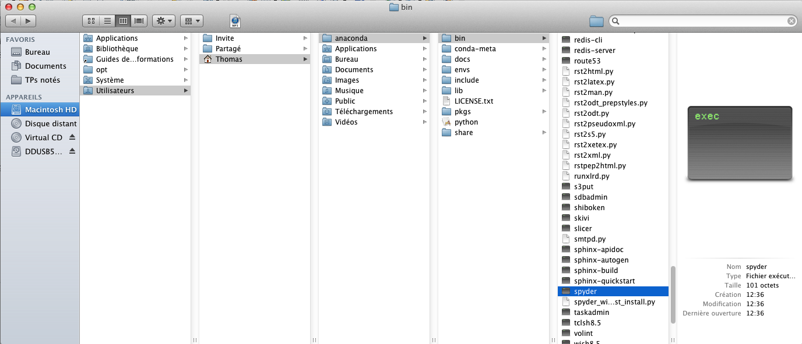
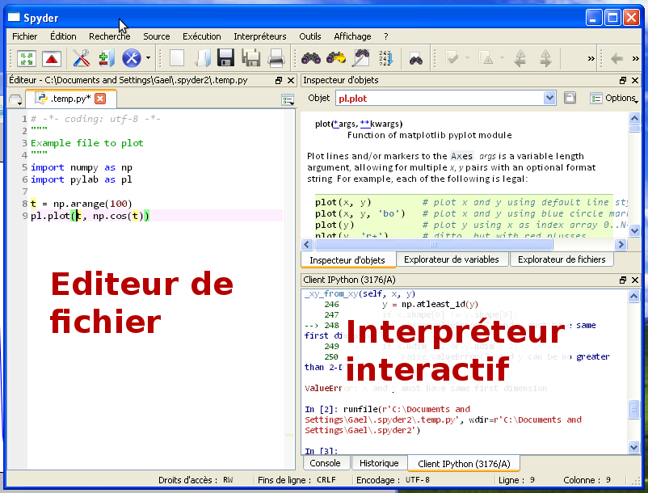
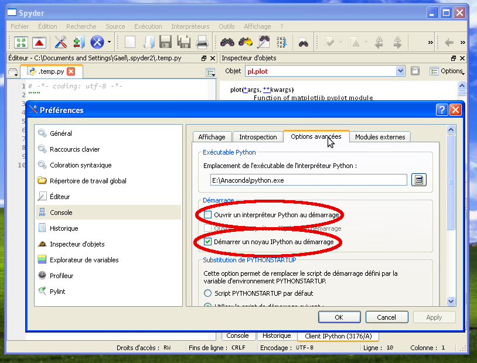
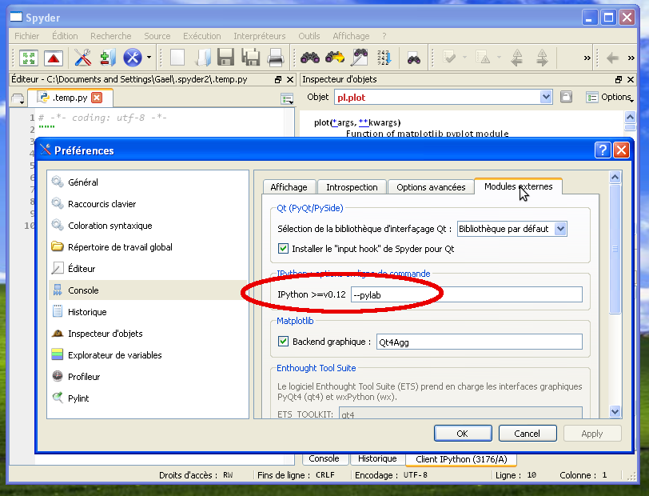
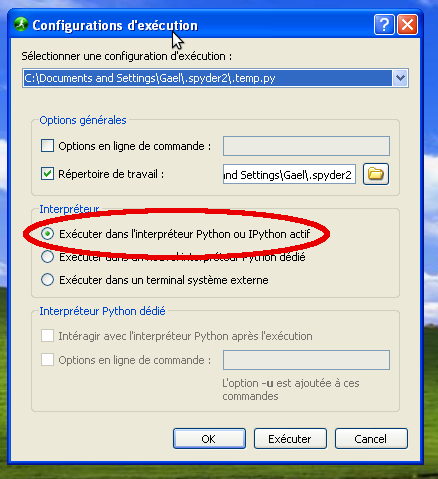

Introduction à Python et son environnement
==========================================

Écosystème et environnement de travail
--------------------------------------

.. figure:: spyder.png
   :scale: 40
   :align: right
  
   Environnement de travail scientifique `spyder <https://code.google.com/p/spyderlib>`_

Python est un langage de programmation très polyvalent et modulaire, qui
est utilisé aussi bien pour écrire des applications comme YouTube, que
pour traiter des données scientifiques. Par conséquent, il existe de
multiples installations possibles de Python. L'utilisateur débutant peut
donc se sentir dérouté par l'absence d'une référence unique pour Python
scientifique. Nous conseillons donc un logiciel unique pour la formation,
`la suite scientifique Anaconda <http://continuum.io/downloads.html>`_
développée par l'entreprise Continuum. Anaconda rassemble tout le
nécessaire pour l'enseignement de Python scientifique: le langage Python
et ses modules scientifiques.

En particulier, Anaconda fournit un environnement de travail adapté à
l'enseignement et au calcul scientifique, `spyder
<https://code.google.com/p/spyderlib>`_, que nous utiliserons pour la
formation.

Installation de l'environnement Python scientifique
....................................................

.. toctree::

   preparation.rst

L'écosystème Python scientifique
.................................

Pour le calcul scientifique il faut utiliser Python 2.

:Python:

    `Langage <http://docs.python.org/2.7/tutorial/index.html>`_ +
    `librairie standard très riche <http://docs.python.org/2.7/library/index.html>`_

    * **Enseignement algorithmique** (`hash cryptographiques
      <http://docs.python.org/2.7/library/crypto.html>`_, 
      `piles partiellement ordonnées
      <http://docs.python.org/2.7/library/heapq.html>`_, `décimaux de taille
      arbitraire <http://docs.python.org/2.7/library/decimal.html>`_)

    * **TIPE** (`manipulation de fichiers <http://docs.python.org/2.7/library/os.html>`_, 
      `calcul parallèle
      <http://docs.python.org/2.7/library/multiprocessing.html>`_,
      `téléchargement de données
      <http://docs.python.org/2.7/library/internet.html>`_).

:numpy:

    `Calcul de tableau et calcul matriciel
    <http://docs.scipy.org/doc/numpy/reference/>`_

:scipy:

    Outils numériques standards: `FFT <http://scipy-lectures.github.com/intro/scipy.html#fast-fourier-transforms-scipy-fftpack>`_,
    `intégration
    <http://docs.scipy.org/doc/scipy/reference/tutorial/integrate.html>`_,
    `résolution de système non-linéaires
    <http://docs.scipy.org/doc/scipy/reference/tutorial/optimize.html>`_

:matplotlib:

    `Tracé de courbes et affichage scientifique <http://matplotlib.org/>`_

Tout est libre, développé en grande partie par des individus sur leur
temps libre.

Un environnement de travail: Spyder
....................................

Pour lancer spyder:

* **Sous windows** exécuter `Anaconda\\Scripts\\spyder.bat`

* **Sous Mac et Linux** exécuter `Anaconda/bin/spyder`

.. |spyder_win| image:: spyder_launcher.png
   :scale: 50

|spyder_win| |spyder_mac|

Spyder présente 2 panneaux que nous allons beaucoup utiliser: **en bas à
droite**, un interpréteur interactif Python, **à gauche** un éditeur pour
écrire ses scripts Python.

Configurer l'environnement
~~~~~~~~~~~~~~~~~~~~~~~~~~~

Nous voulons configurer le panneau de droite pour utiliser l'outil
"IPython", qui permettra la visualisation interactive de données: 

Aller dans les menus `Outils -> Préférences` et dans la boite de dialogue
correspondante, dans la section `Console -> Options avancées`, décocher
"Ouvrir un interpréteur Python au démarrage", et cocher "Démarrer un
noyau IPython au démarrage".

____

Dans l'onglet 'Modules externes', remplacer les options de la ligne de
commande par '--pylab'.

Premiers pas
~~~~~~~~~~~~~

Dans l'interpréteur (panneau de droite), taper '1 + 1'::

    >>> 1 + 1
    2

Dans l'éditeur (panneau de gauche), ajouter la ligne::

    print(1 + 1)

Puis, dans le menu 'Exécution', sélectionner 'Exécution', ou appuyer sur
la touche 'F5'. Dans le dialogue qui s'affiche 'Configurations
d'exécution', sélectionner 'Exécuter dans l'interpréteur Python ou
IPython actif'.

.. sidebar:: Félicitations

    Vous avez un environnement prêt pour le travail
    scientifique avec Python.

Le langage Python
------------------

Différents type d'objets
.............................

Objets simples
~~~~~~~~~~~~~~~

::

   >>> a = 1
   >>> b = 'Bonjour'

`a` et `b` sont des objets de différent types : `a` est un entier
(`int`), et `b` est une chaîne de caractères (`string`).

En Python, les types ne sont pas déclarés explicitement.

========================== =================================================================================
**Nombres**                **Entier** `1` — **Flottant** `1.` — **Complexe** `1 + 1j` — **Booléen** `False`

**Chaînes de caractère**   **Chaînes** `'Bonjour'` — **Chaînes avec accents** `u'Gaël'`
========================== =================================================================================

A différents types d'objets, correspondent différentes opérations possibles:

::

    >>> 2 * a
    2

.. note:: Puissance::

   >>> 2 ** 3
   8

.. warning:: **Division entière**
  
    ::

        >>> 1/2
        0
        >>> 1./2
        0.5
        >>> float(1)/2
        0.5

Collections d'objets
~~~~~~~~~~~~~~~~~~~~~~

* **Listes** ::

    >>> l = [0, 1, 2, 3]
    >>> l[0]
    0

  .. warning:: Les indices commencent à 0, et non à 1

  On peut compter à partir de la fin en indexant une liste::

    >>> l[-1]
    3

  Et on peut avoir des "tranches" d'une liste ("slice" en anglais)::

    >>> l[1:3]
    [1, 2, 3]

  La syntaxe du "slicing" est ``start:stop:step``.

  Une liste peut être modifiée::

    >>> l[0] = -1
    >>> l
    [-1, 1, 2, 3]
    >>> l.append(4)
    >>> l
    [-1, 1, 2, 3, 4]

  .. note:: Les listes sont donc des objets "mutables".

  .. note:: `l.append` est une "méthode" de `l`.

     Les méthodes de `l` peuvent être découverte en appuyant sur `Tab`
     dans IPython::

        In [2]: l.
        append  count  extend  index  insert  pop  remove  reverse  sort

     Pour savoir ce qu'une méthode fait::

        In [2]: l.append?
        Type:       builtin_function_or_method
        String Form:<built-in method append of list object at 0x34fa128>
        Docstring:  L.append(object) -- append object to end

  Une liste peut contenir des objets de type différents::
    
    >>> l = [1, 2., 'hello', ['a', 'b']]

  C'est donc un objet très polyvalent.
  Pour contenir un ensemble de nombres de même type, nous verrons plus
  tard un objet plus efficace (pour la rapidité d'exécution) : les 
  tableaux numériques du module NumPy.

  Finalement, pour créer une liste d'entiers continus::

    >>> l = range(10)
    >>> print l
    [0, 1, 2, 3, 4, 5, 6, 7, 8, 9]

* **Et plus encore**

  :dictionnaires:

    ::

       >>> d = {"Gael": "Informatique", "Werner": "Physique", "Emmanuelle": "Physique"}
       >>> d["Damien"] = "Informatique"
       >>> d["Gael"]
       "Informatique

  :tuple:

    Comme une liste, mais non mutable::

        >>> l = (0, 1, 2, 3)
        >>> l[0] = -1
        ---------------------------------------------------------------------------
        TypeError                                 Traceback (most recent call last)
        <ipython-input-4-2c4c55c1f409> in <module>()
        ----> 1 l[0] = -1

        TypeError: 'tuple' object does not support item assignment

  :set:

    Ensemble d'éléments uniques muni d'opérations comme l'intersection ou
    l'union.

Logique du programme: opérations conditionnelles et boucles
...........................................................

* **Opérations conditionnelles** ::

    >>> a = 1
    >>> if a == 1:
    ...     print('a vaut bien 1')
    ... else:
    ...     print('a ne vaut pas 1')

  .. note:: ``==`` est différent de ``=``. Le premier est un "test" et le
     deuxième une "affectation de variable".

  .. note:: L'indentation délimite les blocs logiques, elle est
     obligatoire.
     
    ::

     >>> if a == 1:
     ...     print('a vaut bien 1')
     ...     print("c'est certain")

  .. note:: Pour taper des instructions sur plusieurs lignes, l'éditeur
     de texte (panneau gauche de spyder) est plus pratique.

  Conditions multiples: ``a == 1 and b == 1``, ``a == 1 or b == 1``

  Autres conditions: ``a != 1`` (a différent de 1), ``a < 1``, ``a > 1``

* **Boucles** ::

    >>> for i in range(3):
    ...     print(i)
    0
    1
    2

  On peut itérer sur les éléments d'une liste::

    >>> l = [0, 1, 2]
    >>> for i in l:
    ...     print i
    0
    1
    2

.. topic:: **Exercice**: Calculer Pi avec la formule de Wallis
    :class: green

    .. math::
        \pi = 2 \prod_{i=1}^{\infty} \frac{4i^2}{4i^2 - 1}

    .. only:: html

        [:ref:`La solution <example_pi_wallis.py>`]

Définir des fonctions
......................

::

    def f(x, y):
        print x
        return x + y

Arguments optionnels::

    def f(x, y=1):
        return x + y

    z = f(x, y=2)

Importer des fonctionnalités additionnelles
............................................

Les "modules" permettent d'importer de nombreuses fonctionnalités
additionnelles, allant de modules d'interface graphique au calcul
scientifique.

Voici un exemple qui importe un nouveau type de nombre, les fractions::

    >>> import fractions
    >>> a = fractions.Fraction(2, 3)
    >>> print a
    2/3
    >>> b = fractions.Fraction(1, 2)
    >>> print b
    1/2
    >>> a + b
    Fraction(7, 6)
    >>> print a + b
    7/6

____

.. seealso::
   
    * `Scipy Lecture Notes <http://scipy-lectures.github.com>`_, `chapitre sur le langage Python <http://scipy-lectures.github.com/intro/language/python_language.html>`_

    * Ouvrage de Gérard Swinnen: `Apprendre à programmer avec Python <http://inforef.be/swi/python.htm>`_

    * `Documentation officielle du langage Python <http://docs.python.org/2.7/>`_

____

.. topic:: **Exercice**: Implémenter `quicksort`
    :class: green

    La `page wikipedia <http://en.wikipedia.org/wiki/Quicksort>`_
    décrivant l'algorithme de tri `quicksort` donne le pseudo-code
    suivant::

     function quicksort('array')
        if length('array') <= 1
            return 'array'
        select and remove a pivot value 'pivot' from 'array'
        create empty lists 'less' and 'greater'
        for each 'x' in 'array'
            if 'x' <= 'pivot' then append 'x' to 'less'
            else append 'x' to 'greater'
        return concatenate(quicksort('less'), 'pivot', quicksort('greater')) 

    Saurez vous transformer ce pseudo-code en code valide Python.

    Des indices:

     * La longueur d'une liste est donnée par ``len(l)``

     * Deux listes peuvent être concaténées avec ``l1 + l2``

     * ``l.pop()`` retire le dernier élément d'une liste

     * Attention: une liste est mutable

    Il vous suffit de compléter cette ébauche::

        def quicksort(l):
            # ...
            return l

        l = [3, 4, 1, 2, 5, 6]
        print quicksort(l)

    .. only:: html

        [:ref:`La solution <example_quicksort.py>`]

Travailler avec beaucoup de nombres
....................................

Lorsque l'on fait du calcul scientifique, on doit souvent travailler avec
de gros ensemble de nombres. Par example, calculons ici les racines
carrées des 10 millions premiers entiers::

    >>> N = 1000000
    >>> l = range(N)
    >>> ll = []         # La liste vide, pour stoquer le résultat
    >>> import math     # L'opération racine carré est définit dans le module math
    >>> for i in l:
    ...     ll.append(math.sqrt(i))

Notez que vous devez attendre un peu que cette boucle s'exécute.

En calcul scientifique, la manière efficace de travailler et d'utiliser
les tableaux ::

    >>> import numpy as np
    >>> l = np.arange(N)    # l est alors un tableau (array) et non une liste
    >>> ll = np.sqrt(l)     # En utilisant 'sqrt' du module numpy, l'opération est réalisée en block

Le module numpy est central au calcul scientifique. Nous le verrons plus
en détail plus tard.

Comprendre les erreurs
.......................

Lorsque Python rencontre une situation dont il ne sait se sortir, il lève
une erreur (exception en jargon)::

    In [1]: 1 + 'a'
    ---------------------------------------------------------------------------
    TypeError                                 Traceback (most recent call
    last)
    <ipython-input-1-bb4aa3e60e23> in <module>()
    ----> 1 1 + 'a'

    TypeError: unsupported operand type(s) for +: 'int' and 'str'

Ici c'est une erreur de 'type': Python ne sait additionner des entiers et
des chaînes de caractère.

::

    In [2]: l = [0, 1]

    In [3]: l[2]
    ---------------------------------------------------------------------------
    IndexError                                Traceback (most recent call last)
    <ipython-input-3-5b08617e4833> in <module>()
    ----> 1 l[2]

    IndexError: list index out of range

Une erreur d'indexation : j'ai donné un indice trop grand pour la liste.

Regardez bien le message d'erreur, il vous en dit beaucoup: de quelle
erreur il s'agit, et où elle s'est produite ::

    In [4]: def f(x):
    ...:     y = 1. / (1 = x)
    ...:     return y
    ...: 
    File "<ipython-input-4-782a072b3f3f>", line 2
        y = 1. / (1 = x)
                    ^
    SyntaxError: invalid syntax

    In [5]: def f(x):
        y = 1. / (1 + x)
        return y
    ...: 

    In [6]: f(-1)
    ---------------------------------------------------------------------------
    ZeroDivisionError                         Traceback (most recent call last)
    <ipython-input-6-512b55eb878d> in <module>()
    ----> 1 f(-1)

    <ipython-input-5-9ac7ba330cae> in f(x)
        1 def f(x):
    ----> 2     y = 1. / (1 + x)
        3     return y

    ZeroDivisionError: float division by zero

