Systèmes statistiques : Nombres aléatoires - Monte Carlo
========================================================

.. topic:: Contenu du chapitre

    * Le modèle ``random`` de Python

    * Gaussiennes : du théorème central limite à la distribution de Maxwell

    * Des marches aléatoires à l'algorithme de Metropolis

    * Une première simulation des sphères dures à deux dimensions.

Le module ``random`` de Python
------------------------------

Le module ``random`` de Python donne accès aux nombres aléatoires
et permet des opérations "stochastiques".  Pour nous informer sur
ce module, nous consultons la documentation online (voir
http://docs.python.org/2/library/random.html) et faisons appel à l'aide: ::

    In [1]: import random
    In [2]: help(random)

Quelques exemples (random.random) ::

    In [3]: random.random()
    Out[3]: 0.18430830705349943

    In [4]: random.seed(12345)

    In [5]: random.random()
    Out[5]: 0.41661987254534116
    
Plus généralement (random.uniform) ::

    In [6]: random.uniform(-1,1)
    Out[6]: -0.6200572425563593

    In [7]: random.uniform(-1,1)
    Out[7]: -0.31687914845289566

    In [8]: a = random.uniform(-1,1)
    In [9]: a
    Out[9]: -0.9529575637155989

    In [10]: a
    Out[10]: ???

    In [11]: a = random.uniform(-1,1)
    In [11]: a
    Out[11]: ???

et encore (shuffle, choice, randint) ::

    In [12]: L = range(10)

    In [13]: L
    Out[13]: [0, 1, 2, 3, 4, 5, 6, 7, 8, 9]

    In [14]: random.shuffle(L)
    In [15]: L
    Out[15]: [1, 6, 2, 9, 4, 0, 5, 7, 8, 3]

    In [16]: random.choice(L)
    Out[16]: 8

    In [17]: random.randint(0,1)
    Out[17]: ??? 

Pour conclure (mixed type) ::

    In [18]: L = [1, 2, 'ENS-CPGE', [1.1, 2.1]] 
    In [19]: random.choice(L)
    Out[19]: [1.1, 2.1 ] 
    In [20]: random.shuffle(L) 
    Out[20]: ???

C'est à l'aide du module ``random`` que nous introduisons **sans peine**
au calcul de Monte Carlo, des origines jusqu'à la recherche (presque)
de nos jours.  D'abord, faisons un histogramme des nombres aléatoires
générés par la ``méthode`` **random.random** :

.. image:: W_random_hist.png
      :scale: 75
      :align: center     

Voici comment nous générons la figure (utilisant le module
`matplotlib <http://matplotlib.org/>`_), tout en construisant, petit à petit, une liste L,
en ajoutant des nombres aléatoires : ::

    import matplotlib.pyplot as plt
    import random
    L = []
    for i in range(10000):
        a = random.random()
        L.append(a)
    plt.hist(L, 20, normed='True')
    plt.show()

Pour arriver à l'histogramme, nous pouvons aussi emprunter une voie
ultra-rapide (et sauvegarder la figure dans un fichier) : ::

    import matplotlib.pyplot as plt, random
    L = [random.random() for i in range(10000)]
    plt.hist(L, 20, normed='True')
    plt.savefig('Random_histogram.png')
    plt.show()

NB : La facilité avec laquelle se construisent (et se modifient) les
figures est un des nombreux atouts du langage ``Python``. Il y a plusieurs
approches possibles. Nous nous restreignons ici au module ``pyplot``
(similaire à ``Matlab``®), et adoptons une approche ``learning by doing``.

Vérifions alors le théorème central limite, qui dit que la somme de
variables aléatoires converge vers une distribution gaussienne :

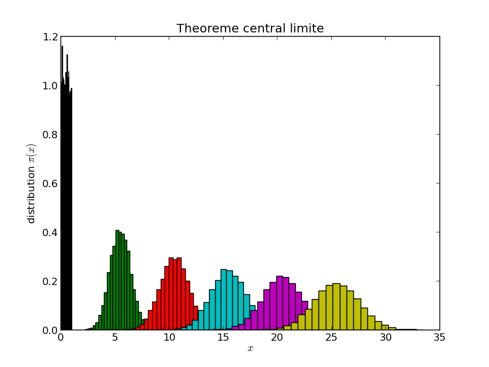

Voici le programme : ::

    import matplotlib.pyplot as plt
    import random
    for k in range(1, 52, 10):
        L = []
        for i in range(10000):
            a = sum(random.random() for l in range(k))
            L.append(a)
        plt.hist(L, 25, normed='True')
    plt.title('Theoreme central limite')
    plt.xlabel('$x$')
    plt.ylabel('Distribution $\pi(x)$')
    plt.savefig('W_sum_of_random.png')
    plt.show()

Ici, la version ultra-rapide du programme calculant et
traçant la somme des `random` : ::

    import matplotlib.pyplot as plt, random
    for k in range(1,52,10):
        L = [sum(random.random() for l in range(k)) for i in range(10000)]
        plt.hist(L,25,normed='True')
    plt.show()

Dans des applications, on remplacera naturellement la somme des nombres
aléatoires par la fonction ``gauss`` (version ultra-rapide, avec
cohabitation de **hist** et de **plot**) : ::

    import matplotlib.pyplot as plt
    import random, math
    L = [random.gauss(0., 1.) for i in range(10000)]
    plt.hist(L, 100, normed='True')
    x = [i/100. for i in range(-200,200)]
    y = [math.exp(-s**2 / 2)/(math.sqrt( 2 * math.pi)) for s in x]
    plt.plot(x, y)
    plt.show()

**Exercice** : Illustrez, sur une même figure, que la somme des variables aléatoires ``random``
donne bien une distribution gaussienne. Procédez aux changements d'échelle sur 
la partie générant les échantillons.

Distribution de Maxwell
-----------------------

Regardons des vecteurs de variables gaussiennes, d'abord en deux dimensions: 
Le programme suivant illustre que la distribution de vecteurs de gaussiennes 
est isotrope dans l'espace, ici en deux dimensions... 

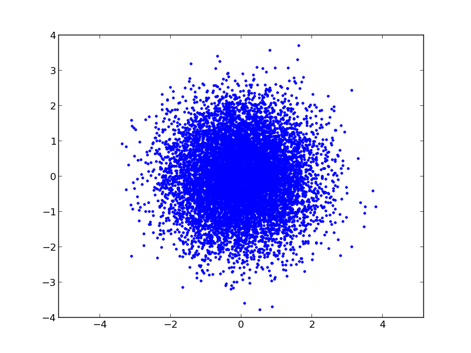

Voici le programme : ::

    import matplotlib.pyplot as plt
    import random, math
    x, y = [], []
    for i in range(10000):
        a, b = random.gauss(0.0, 1.0), random.gauss(0.0, 1.0)
        x.append(a)
        y.append(b)
    plt.plot(x, y, '.')
    plt.axis('equal')
    plt.show()

... et ici en trois dimensions (notons l'utilisation d'un affichage en trois 
dimensions, et celle d'une deuxième figure pour l'histogramme des rayons...

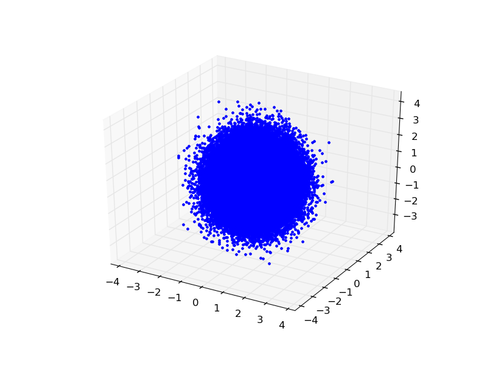

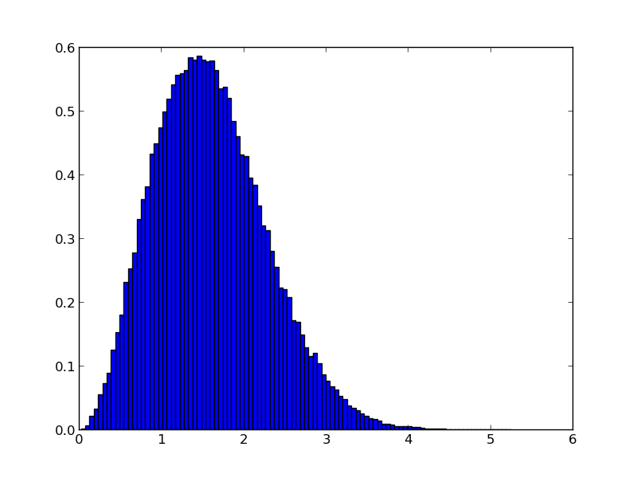

***Exercice** : Déterminez la distribution en r. 

Voici le programme : ::

    from mpl_toolkits.mplot3d import Axes3D
    import matplotlib.pyplot as plt
    import random
    import math
    ax = plt.gca(projection='3d')  # Active la vue 3D
    ax.set_aspect('equal')
    x, y, z = [], [], []
    radius = []
    for i in range(100000):
        a,b,c = random.gauss(0.0, 1.0), random.gauss(0.0, 1.0), random.gauss(0.0, 1.0)
        radius.append(math.sqrt(a**2 + b**2 + c**2))
        x.append(a)
        y.append(b)
        z.append(c)
    plt.plot(x, y, z, '.')
    plt.show()
    plt.clf()
    plt.hist(radius, 100, normed='True')
    plt.show()

Maintenant, nous modifions le programme, en mettant tous les vecteur à la même longueur
(sans toucher à leur direction). Voici le résultat (en trois dimensions) :

.. image:: W_three_gaussians_projected.png
      :scale: 75
      :align: center     

et voici le programme : :: 

    from mpl_toolkits.mplot3d import Axes3D
    import matplotlib.pyplot as plt
    import random
    import math
    fig = plt.figure()
    ax = fig.gca(projection='3d')
    ax.set_aspect('equal')
    x, y, z = [], [], []
    for i in range(1000):
        a,b,c = random.gauss(0.0, 1.0), random.gauss(0.0, 1.0), random.gauss(0.0, 1.0)
        length = math.sqrt(a ** 2 + b ** 2 + c ** 2)
        x.append(a / length)
        y.append(b / length)
        z.append(c / length)
    plt.plot(x, y, z, '.')
    plt.show()

NB : La distribution gaussienne uni-dimensionnelle est unique à donner
une distribution isotrope en N dimensions, de cette sorte.  C'est ceci le
coeur de l'argument de Maxwell (1861) établissant que la distribution des
composantes v_x, v_y, v_z de la vitesse des atomes dans un gaz est une
gaussienne. C'est aussi le raisonnement fondateur de la physique statistique...
en seize lignes de code ``Python`` !

Monte Carlo - échantillonnage direct
------------------------------------
 
Si nous construisons un vector, non pas avec des Gaussiennes, mais avec des 
variables uniformément distribuées dans l'intervalle (-1,1), nous allons remplir, 
en deux dimensions, uniformément le carré entre (-1,-1) et (1,1).

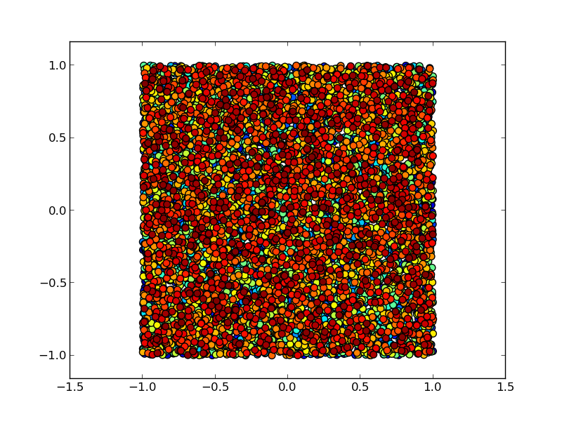

Voici le programme (notez l'utilisation d'un code de couleurs progressif) : :: 

    import matplotlib.pyplot as plt
    import random
    import math
    x, y = [], []
    for i in range(10000):
        a, b = random.uniform(-1., 1.), random.uniform(-1. ,1.)
        x.append(a)
        y.append(b)
    xyc = range(len(x))
    plt.scatter(x, y, c = xyc, marker = '.', s=200)
    plt.axis('equal')
    plt.show()

Ceci est la base de la méthode de Monte Carlo. Ici, nous l'utilisons pour calculer
la valeur de pi, en comptant combien des échantillons du carré se retrouvent à 
l'intérieur du premier quadrant du cercle unité (cercle de rayon 1 centré en 0, x > 0, y > 0) : 

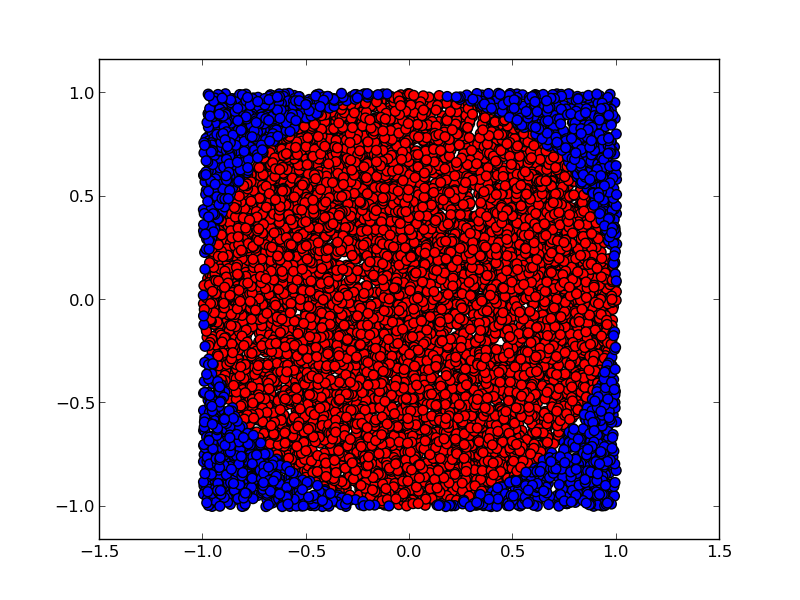

Voici le programme (utilisant deux listes, plutôt qu'un code de couleurs compliqué) : ::

    import matplotlib.pyplot as plt
    import random
    import math
    x_inner, y_inner = [], []
    x_outer, y_outer = [], []
    for i in range(100000):
        a, b = random.uniform(-1., 1.), random.uniform(-1., 1.)
        length = math.sqrt(a**2 + b**2)
        if length < 1:  # Le point est dedans
            x_inner.append(a)
            y_inner.append(b)
        else:
            x_outer.append(a)
            y_outer.append(b)
    plt.scatter(x_inner, y_inner, c='red', marker='.', s=200)
    plt.scatter(x_outer, y_outer, c='blue', marker='.', s=200)
    print 4*len(x_inner)/float(len(x_inner) + len(x_outer)), math.pi
    plt.axis('equal')
    plt.savefig('W_direct_pi_color2.png')
    plt.show()

Le rapport de l'aire bleue à l'aire totale est pi/4. Nous savons donc aussi calculer pi.

Si vous n'êtes pas surpris de pouvoir calculer pi, modifiez les deux lignes : ::

        length = math.sqrt(a**2 + b**2)
        if length < 1:

... par : ::

    if (a - 0.6)**2 + (b - 0.35)**2 < 0.5:

... et obtenez le résultat analytique dans ce cas aussi (bonne chance !).

-----

Chaînes de Markov, algorithme de Metropolis
-------------------------------------------

Nous passons aux marches aléatoires. Chaque point est obtenu à partir de son 
prédecesseur, grâce à un petit changement (notez l'utilisation d'une grille
(``grid``), de ``scatter`` plutôt que de ``plot``, et d'un code couleur
permettant de suivre l'évolution temporelle) :

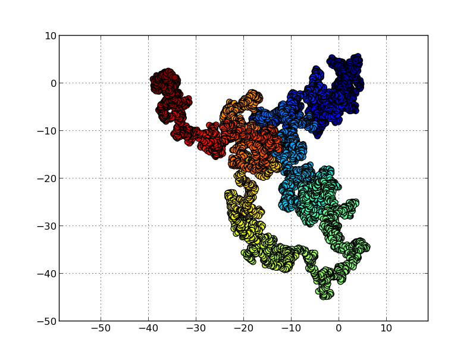

Voici le programme de simulation de la marche aléatoire en deux dimensions : ::

    import matplotlib.pyplot as plt
    import random
    x, y = 0., 0.
    x_plot = [x]
    y_plot = [y]
    delta = 0.5
    for i in range(10000):
        del_x = random.uniform(-delta, delta)
        del_y = random.uniform(-delta, delta)
        x, y = x + del_x, y + del_y
        x_plot.append(x)
        y_plot.append(y)
    plt.grid()
    plt.scatter(x_plot, y_plot, c=range(len(x_plot)), marker='.', s=200)
    plt.axis('equal')
    plt.show()

Cette marche aléatoire partira à l'infini (pour toujours revenir, en deux dimensions).

Mais comment construire une marche aléatoire restant à l'intérieur du carré
((-1,1), (1,1)), tout en y possédant une distribution uniforme ? Ce
problème a été résolu dans le célèbre travail de Metropolis et
al (1953) : en cas de refus, restons sur la configuration, et comptons-la
de nouveau. Voici le résultat :

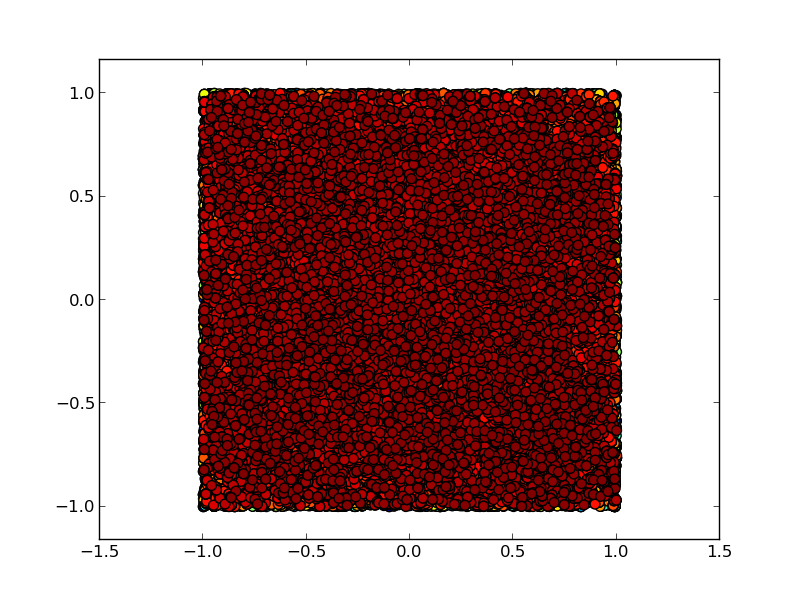

Voici le programme : ::

    import matplotlib.pyplot as plt
    from random import uniform
    import math
    x_plot, y_plot = [], []
    x, y = 1., 1.
    delta = 0.1
    for i in range(100000):
        del_x = random.uniform(-delta, delta)
        del_y = random.uniform(-delta, delta)
        if abs(x + del_x) < 1 and abs(y + del_y) < 1:  # on sort du carre ? 
            x, y = x + del_x, y + del_y
        x_plot.append(x)
        y_plot.append(y)
    xyc = range( len(x_plot) )
    plt.scatter(x_plot, y_plot, c=xyc, marker='.', s=200)
    plt.axis('equal')
    plt.show()
    plt.clf()
    plt.hist(x_plot, 100, normed='True')
    plt.show()

... et ici la deuxième figure, l'histogramme en x des échantillons obtenus : 

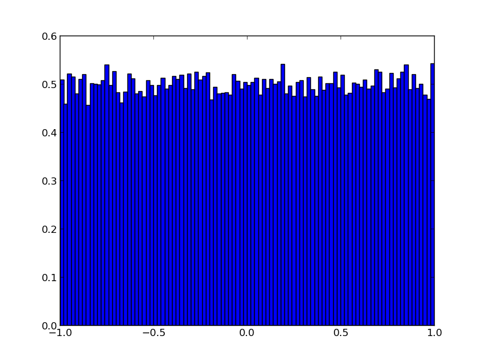

NB : nous aurions pu prendre des gaussiennes pour générer del_x et del_y...

Voici une version du même programme uniquement dédié au calcul de pi (notez l'utilisation 
d'une fonction) : ::

    from random import uniform
    def markov_pi(delta, N):
        x, y = 1., 1.
        N_hits = 0
        for i in range(N):
            del_x = random.uniform(-delta, delta)
            del_y = random.uniform(-delta, delta)
            if abs(x + del_x) < 1 and abs(y + del_y) < 1: # on sort du carre ?
                x, y = x + del_x, y + del_y
            if x**2 + y**2 < 1: # a l'interieur du cercle ? 
                N_hits += 1
        return 4 * N_hits / float(N)

    for k in range(10):
       print k, markov_pi(0.3, 100000)

**Attention** : La 7ème ligne de cette fonction est non-triviale : si le
mouvement *x,y -> x + del_x, y + del_y* est interdit, on utilise *x,y* une
deuxième fois.

**Exercice** : Dans ce programme, chacune des 10 "chaînes de Markov"
débute au point (1,1).  Modifiez-le pour que la chaîne k débute
en fait sur la dernière des configurations de la chaîne k-1. Trouvez
une astuce pour bien initier cette simulation.

NB : Pour ce problème, nous pourrions introduire des limites aux
bords périodiques. Mais en général, ceci n'est pas possible.

Algorithme de Metropolis pour sphères dures
-------------------------------------------

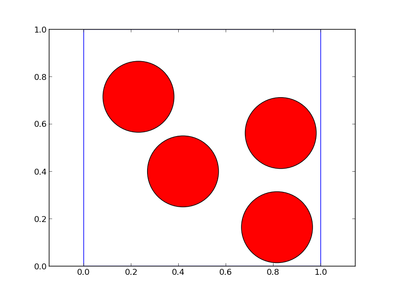

Dans le célebre problème des sphères dures, il s'agit de générer des configurations
aléatoires de N disques dans une boîte. En 1953, Metropolis et al ont proposé cet 
algorithme pour le résoudre. Il s'agit de l'exact analogue de l'algorithme chaîne de Markov
que nous avons utilisé pour calculer pi : ::

    from random import uniform as ran, choice
    import matplotlib.pyplot as plt
    L = [(0.25, 0.25), (0.75, 0.25), (0.25, 0.75), (0.75, 0.75)]
    sigma = 0.15
    delta = 0.15
    square_x = [0, 1, 1, 0, 0]
    square_y = [0, 0, 1, 1, 0]
    number = 0
    for iter in range(100):
       a = choice(L)
       L.remove(a)
       b = (a[0] + ran(-delta, delta), a[1] + ran(-delta , delta))
       min_dist = min( (b[0]-x[0])**2 + (b[1]-x[1])**2 for x in L )
       box_cond = min(b[0],b[1]) < sigma or max(b[0],b[1]) > 1-sigma
       if box_cond or min_dist < 4*sigma**2:
          L.append(a)
       else:
          L.append(b)
       if iter % 1 == 0:
           number += 1
           plt.axes()
           for x, y in L:
               cir = plt.Circle((x, y), radius=sigma,  fc= 'r')
               plt.gca().add_patch(cir)
           plt.axis('equal')
           plt.plot(square_x, square_y)
           plt.savefig('W_markov_disks' + str(number) + '.png')
           plt.show()
           plt.clf()

Voici une animation, avec des configurations prises tous les 100 pas :

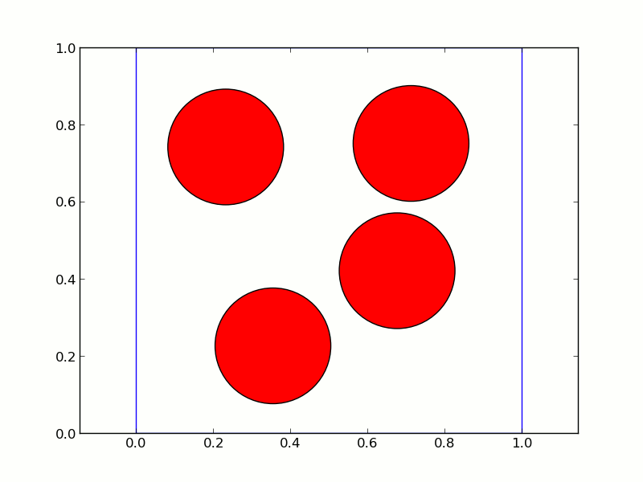

Conclusion
----------

Nous voilà au coeur de la physique statistique, avec des processus
statistique décrivant des phénomènes physiques, comme la transition
liquide-solide, le comportement des matériaux, et la structure de la
matière. Dans tout ceci, la simulation numérique, notamment celle
utilisant la méthode de Monte Carlo, est très utilisée, et le langage
``Python`` s'y porte très bien. Derrière l'image simple du langage se cache 
toute la complexité de la programmation moderne.
