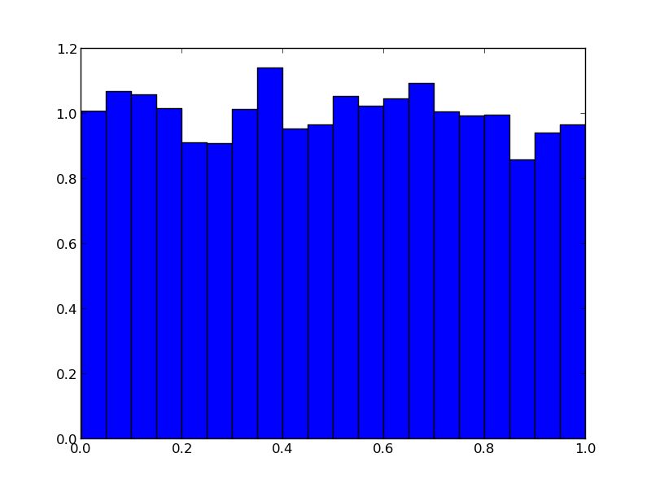

Systèmes statistiques : Nombres aléatoires - Monte Carlo
==========================================

.. topic:: Contenu du chapitre

    * Nombres aléatoires

    * Gaussiennes : du théorème central limite à la distribution de Maxwell

    * Chaînes de Markov

    * Transition de phases liquide - gaz (disques durs)

Le module ``random`` de Python
------------------------------

Le module ``random`` de Python permet des applications simples du 
calcul stochastique, et une introduction **sans peine** aux calculs de Monte Carlo.
Il donne accès aux nombres aléatoires réels et entiers, distribués selon des lois 
différents (uniforme, gauss, etc). 

Ici, la fonction random du module random génère des nombres aléatoires uniformement 
distribués dans l'intervalle [0,1], comme le montre l'histogramme.

NB: le module ``random`` http://docs.python.org/2/library/random.html

.. literalinclude:: W_random_hist.py

.. figure:: auto_examples/images/plot_random_hist_1.png
    :scale: 80
    :target: auto_examples/plot_random_hist.html

Comme première application, nous allons vérifier le théorème central limite.

.. literalinclude:: W_sum_of_random.py

NB: voir ici pour une version ultra-compacte du programme calculant et traçant
la somme des random:

.. literalinclude:: W_sum_of_random_short.py

Dans des applications, on remplacera naturellement la somme des nombres aléatoires 
par la fonction ``gauss``

.. literalinclude:: W_gauss_hist.py

Distribution de Maxwell
-----------------------

Ici, une petite application qui est la base de la distribution de Maxwell (exemple 
en deux dimensions)

.. literalinclude:: W_two_gaussians_rescaled.py

Le point est qu'un vecteur de gaussiennes, de longueur $N$,  
est uniformément distribué, en angle, sur la sphere de $N$ dimensions. 
Regardons ceci dans un espace à trois dimensions, avec une illustration adaptée.

.. literalinclude:: W_three_gaussians_projected.py

On voit que les vecteurs gaussiens rescalés sont uniformément distribués sur 
l'hypersphère. Pour déduire la distribution de Maxwell, il faut inverser cet 
argument: Pour générer des vecteurs uniformes sur une hypersphère, il faut partir
d'éléments gaussiens. 

Monte Carlo - échantillonnage direct
------------------------------------

.. literalinclude:: W_direct_pi_color.py

Il est évident que le rapport de l'aire bleue par rapport à l'aire rouge est pi/4,
mais modifions le programme un tout petit peu... 

Nous pouvons programmer la même chose, à quelques détails près, en NumPy ::

    import matplotlib.pyplot as plt
    import numpy as np
    from random import uniform
    import math
    X = np.array([[uniform(-1.,1.),uniform(-1.,1.)] for k in range(10000)])
    plt.plot(X[:,0], X[:,1], 'rs')
    plt.show()

... et essayons un calcul un peu plus intéressant: 

.. literalinclude:: W_direct_volume_color.py

Chaînes de Markov, Algorithme de Metropolis
-------------------------------------------

Programmons une version incrémentale du programme de calcul, en ajoutant
quelques modifications, comme l'utilisation d'une fonction markov_pi.

.. literalinclude:: W_markov_pi.py

Algorithme de Metropolis pour sphères dures
-------------------------------------------

.. literalinclude:: W_markov_disks_box.py

Transition de phases liquide - solide
-------------------------------------

Conclusion
----------

